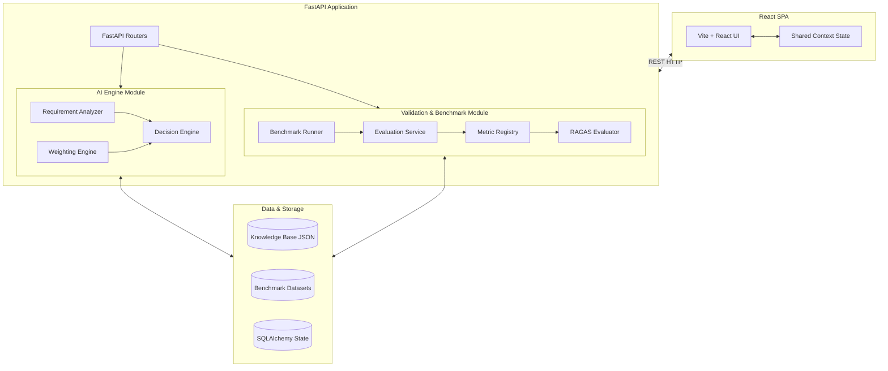
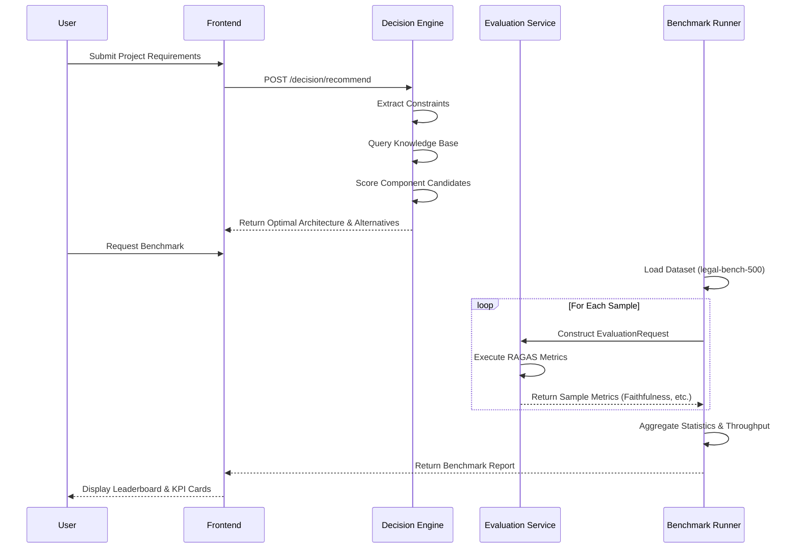

<p align="center">
  
</p>

<h1 align="center">Forge</h1>

<p align="center">
Every Great AI System Starts with the Right Draft.
</p>

<p align="center">
  
  
  
  
  
  
  
  
  
  
  
  
  
  
  
</p>

## Table of Contents

- [Introduction](#introduction)
- [Why Forge Exists](#why-forge-exists)
- [Key Features](#key-features)
- [Architecture Overview](#architecture-overview)
- [System Flow](#system-flow)
- [Project Structure](#project-structure)
- [Core Modules](#core-modules)
- [Tech Stack](#tech-stack)
- [Engineering Workflow](#engineering-workflow)
- [Installation](#installation)
- [Example Usage](#example-usage)
- [Design Principles](#design-principles)
- [Current Status](#current-status)
- [Roadmap](#roadmap)
- [Contributing](#contributing)
- [License](#license)

## Introduction

Forge is an AI Engineering Decision Support Platform designed for software engineers and systems architects building modern Large Language Model (LLM) and Retrieval-Augmented Generation (RAG) applications. 

Rather than serving as an ordinary AI chat assistant, Forge focuses entirely on **architecture reasoning**. It solves the "blank canvas" problem by systematically transforming high-level business constraints and technical requirements into structured, evidence-backed architecture recommendations. Forge explicitly details why each engineering decision is made, compares viable alternatives, and provides an end-to-end framework for benchmarking and evaluating those decisions statistically.

## Why Forge Exists

Building production-grade AI systems requires navigating an overwhelming matrix of engineering decisions. Engineers face significant pain points when attempting to confidently choose between:
- **LLMs**: Proprietary vs. open-weight, low latency vs. high reasoning.
- **Embedding Models**: Dimensionality, maximum sequence length, domain specificity.
- **Vector Databases**: Managed services vs. on-premise, HNSW vs. IVF-Flat indexing.
- **Chunking Strategies**: Fixed-size vs. semantic, overlap margins, parent-child retrieval.
- **Retrieval Techniques**: Dense vs. sparse (BM25), hybrid search, reciprocal rank fusion.
- **Rerankers**: Cross-encoders vs. LLM-as-a-judge re-ranking.
- **Evaluation Frameworks**: Automated metric suites, LLM-driven quality gates.
- **Deployment Targets**: Cloud-native environments vs. edge deployments.

Forge exists to assist in resolving these tradeoffs. It utilizes structured knowledge and deterministic scoring constraints to propose an optimal stack, removing ambiguity from the system design phase.

## Key Features

- **Decision Engine**: Transforms requirements into structured configurations utilizing a deterministic constraint-based scoring system.
- **Architecture Recommendation**: Generates a unified technology stack recommendation spanning models, infrastructure, and deployment targets.
- **Constraint-based Scoring**: Evaluates candidate LLMs, embedding models, and chunking strategies dynamically based on user-defined limits (e.g., latency, cost, security).
- **Explanation Engine**: Exposes the rationale behind every selected component to ensure transparency.
- **Alternative Comparison**: Outlines viable alternative architectures and explicitly documents the tradeoffs via radar chart metrics.
- **Evaluation Engine**: Verifies generated outputs against standard metrics (Faithfulness, Answer Relevancy, Precision, Recall) using the RAGAS framework.
- **Benchmarking**: Validates selected architectures against pre-computed RAG datasets and visualizes leaderboard latency, throughput, and accuracy without fabricating data.
- **Knowledge Base**: Curated internal domain knowledge regarding current LLM capabilities and vector database limits.
- **Report Generation**: Aggregates recommendations, evaluations, and benchmarks into downloadable engineering reports (PDF/JSON).

## Architecture Overview



## System Flow



## Project Structure

```text
forge/
├── backend/
│   ├── app/
│   │   ├── api/             # FastAPI route definitions
│   │   ├── core/            # Application config and environment variables
│   │   ├── datasets/        # Static evaluation datasets (JSONL)
│   │   ├── decision/        # Constraint extraction and component scoring
│   │   ├── embeddings/      # Vector embedding wrappers
│   │   ├── evaluation/      # Core evaluation engine
│   │   ├── history/         # SQLAlchemy state management
│   │   ├── metrics/         # Metric registries and RAGAS integration
│   │   ├── reports/         # PDF and JSON export generation
│   │   ├── schemas/         # Pydantic v2 validation models
│   │   └── services/        # Orchestration layer for API routes
│   ├── ai_engine/           # Core prompting and orchestration logic
│   └── knowledge_base/      # Domain knowledge (LLMs, Vector DBs)
├── frontend/
│   ├── src/
│   │   ├── components/      # Reusable UI elements (Cards, Badges, Loaders)
│   │   ├── context/         # React Context for global state (ForgeContext)
│   │   ├── pages/           # Main views (Decision, Benchmark, Evaluation, etc.)
│   │   ├── services/        # HTTP API client services
│   │   ├── types/           # TypeScript interfaces matching Pydantic
│   │   └── utils/           # Formatting and pure logic utilities
│   └── package.json
└── README.md
```

## Core Modules

| Module | Purpose |
| --- | --- |
| **Decision Engine** | Analyzes system requirements against known constraints to generate optimal technology recommendations and explicit explanations. |
| **Knowledge Base** | Stores factual, up-to-date specifications for LLMs, embedding models, and vector stores to ground decisions in reality. |
| **Evaluation Engine** | Verifies generated RAG outputs using quality metrics via deep integration with the RAGAS framework. |
| **Benchmark** | Validates architectures statistically against baseline datasets (latency, throughput, cost, accuracy). |
| **Comparison** | Provides side-by-side tradeoff visualizations for alternative architectures. |
| **Reports** | Aggregates the unified workflow data into shareable PDF/JSON engineering documents. |
| **Frontend** | React SPA that serves as the interactive dashboard for the decision matrix. |
| **Backend** | FastAPI application hosting the deterministic reasoning engine and evaluation services. |

## Tech Stack

| Category | Technology | Purpose |
| --- | --- | --- |
| **Frontend** | React, TypeScript, Vite, Framer Motion | High-performance, modular SPA rendering with complex micro-animations |
| **Backend Core** | FastAPI, Python, Pydantic | High-throughput async REST API with strict schema validation |
| **Database** | SQLAlchemy, Qdrant | Structured application state storage and vector operations |
| **AI Orchestration** | LangChain, LlamaIndex | Graph orchestration and structured retrieval pipelines |
| **Model Interfaces** | OpenAI, Groq, HuggingFace | Foundational intelligence and embeddings |
| **Evaluation** | RAGAS | Statistically robust RAG generation validation |
| **Embeddings** | Sentence Transformers | Local document and query embedding execution |
| **Infrastructure** | Docker | Containerized, reproducible deployment environments |

## Engineering Workflow

1. **Requirements**: User inputs their constraints (e.g., latency, cost, security, domain).
2. **Architecture Recommendation**: Forge filters candidates and recommends a highly specific LLM, embedding model, and vector DB.
3. **Explanation**: Forge outputs exactly *why* components were chosen or rejected.
4. **Evaluation**: Single outputs can be validated against RAGAS metrics.
5. **Benchmark**: Pre-computed baseline datasets are used to evaluate latency and throughput at scale.
6. **Comparison**: The user compares alternatives side-by-side.
7. **Report Generation**: Data is exported as a unified engineering specification.

## Installation

### 1. Clone the Repository
```bash
git clone https://github.com/yourusername/forge.git
cd forge
```

### 2. Backend Setup
```bash
cd backend
python -m venv .venv
source .venv/bin/activate  # On Windows: .venv\Scripts\activate
pip install -r requirements.txt
```

### 3. Frontend Setup
```bash
cd ../frontend
npm install
```

### 4. Environment Variables
Create a `.env` file in the root `forge/` directory:
```env
OPENAI_API_KEY=your_openai_key
GROQ_API_KEY=your_groq_key
EVALUATION_MODEL=gpt-4o-mini
```

### 5. Run the Backend
```bash
cd backend
uvicorn app.main:app --reload --port 8000
```

### 6. Run the Frontend
```bash
cd frontend
npm run dev
```

## Example Usage

1. **User enters requirements**: A user inputs their constraints (e.g., "We need a legal document QA system with high security compliance and <500ms latency").
2. **Forge recommends architecture**: The decision engine outputs an on-premise configuration using hybrid retrieval and Qdrant.
3. **User evaluates architecture**: Forge generates explanations outlining exactly why cloud services were rejected due to security compliance.
4. **Benchmarks architectures**: The proposed architecture runs against a 500-question legal dataset to verify latency limits.
5. **Compares alternatives**: The user views a side-by-side tradeoff matrix comparing the selected stack against alternatives.
6. **Generates report**: The final architecture is exported as a unified document for the engineering team.

## Design Principles

- **Evidence-Driven Recommendations**: Avoids blindly guessing architectures; maps decisions directly to explicitly declared constraints.
- **Deterministic Scoring**: Utilizes rigid weighting mechanisms rather than pure LLM probabilistic completion.
- **Transparent Reasoning**: "Why" is treated as a first-class citizen alongside "What".
- **Explainability**: Focuses heavily on avoiding black-box decision systems.
- **Engineering-First Design**: Built to integrate directly into architectural design documents.
- **Modular Architecture**: Componentized to allow swapping model providers, vector stores, and evaluation frameworks independently.

## Current Status

Forge is currently under active development. The underlying evaluation APIs, frontend components, and decision matrices are stable, but this project is not yet certified for direct production usage without proper environment configuration and review.

## Roadmap

- [ ] Live pipeline benchmarking
- [ ] Additional knowledge domains
- [ ] Multi-provider deployment configurations
- [ ] More evaluation datasets
- [ ] Architecture export improvements

## Contributing

Contributions are highly encouraged. Please ensure that PRs directly align with the core philosophy of maintaining a transparent, non-probabilistic decision matrix. 

1. Fork the Project
2. Create your Feature Branch (`git checkout -b feature/AmazingFeature`)
3. Commit your Changes (`git commit -m 'Add some AmazingFeature'`)
4. Push to the Branch (`git push origin feature/AmazingFeature`)
5. Open a Pull Request

## License

Distributed under the MIT License. See `LICENSE` for more information.
