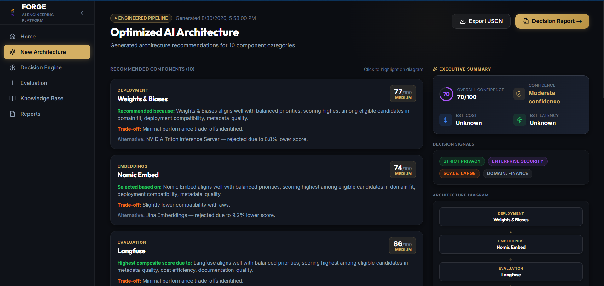

# Forge

Every Great System Starts with the Right Draft.

Traditional AI system design forces engineers to manually research, compare, and validate dozens of LLMs, embedding models, vector databases, and retrieval strategies. Forge is an AI Engineering Decision Support Platform that solves this by transforming natural-language project requirements into evidence-backed architecture recommendations. By retrieving real-world engineering constraints from a vector knowledge base and applying deterministic scoring, Forge reasons about trade-offs and produces a comprehensive, exportable architecture decision report.

## Demo

- **Frontend Application (Vercel)**: [https://forge-beta-gilt-16.vercel.app](https://forge-beta-gilt-16.vercel.app)
- **Backend API (Render)**: [https://forge-mmz3.onrender.com](https://forge-mmz3.onrender.com)
- **Source Code**: [https://github.com/somiya-namdeo/Forge](https://github.com/somiya-namdeo/Forge)

## Product Overview

Designing a modern Retrieval-Augmented Generation (RAG) or AI stack requires balancing complex constraints: cost, latency, compliance, domain specificity, and scalability. Engineers often spend weeks reading documentation and benchmarking models to select the right stack.

Forge automates this foundational architectural phase. You simply describe your system requirements in natural language. Forge parses these requirements, semantically searches a curated knowledge base of AI components (LLMs, Vector DBs, Embedding Models), evaluates technology alternatives against your specific constraints, and generates a structured, defensible engineering decision report.

## Screenshots / Product Walkthrough

### 1. Landing Page

    
    
<i>Natural-Language Requirements — Describe an AI system and its engineering constraints in plain language.</i>

## Key Capabilities

- **Natural-language requirement analysis**: Extracts scale, budget, and deployment targets from raw text.
- **Constraint extraction**: Identifies hard engineering constraints (e.g., "must be open-source", "requires on-premise deployment").
- **Knowledge retrieval**: Fetches up-to-date specifications of LLMs and databases via vector search.
- **Technology recommendation**: Suggests optimal models, vector stores, and deployment targets.
- **Engineering trade-off analysis**: Analyzes latency vs. cost and quality trade-offs.
- **Evidence-backed decisions**: Explains exactly *why* a component was chosen.
- **Architecture report generation**: Compiles all rationale into a unified engineering specification.
- **PDF export**: Generates shareable ReportLab PDFs of the final architecture.
- **Evaluation workflow**: Validates generation and retrieval contexts using Ragas metrics.
- **Structured knowledge base**: Powered by Qdrant for semantic technology matching.

## How Forge Works

\\\mermaid
flowchart TD
    A[User Requirements] --> B[Requirement Analysis]
    B --> C[Project Profile]
    C --> D[Knowledge Retrieval]
    D --> E[Candidate Evaluation]
    E --> F[Architecture Decision]
    F --> G[Decision Report]
    G --> H[JSON / PDF Export]
\\\

### 2. Architecture Decision Report

    
    
<i>Architecture Decision Report — Forge transforms project requirements into structured, evidence-backed architecture decisions.</i>

## System Architecture

\\\mermaid
graph TD
    Client[React Frontend] --> API[FastAPI API Layer]

    subgraph Backend Core
        API --> DE[Decision Engine]
        API --> EV[Evaluation Engine]
        API --> Rep[Report Generator]
    end

    subgraph Decision Engine
        DE --> RA[Requirement Analyzer]
        DE --> RER[Recommendation Engine]
        DE --> RET[Retrieval Layer]
    end

    subgraph Knowledge & ML
        RET --> ES[Embedding Service]
        ES --> HF[Hugging Face Inference API]
        RET --> QD[(Qdrant Vector DB)]
    end

    EV --> RAGAS[Ragas Metrics]
    Rep --> PDF[ReportLab PDF Export]
\\\

### 3. Knowledge Base

    
    
<i>Engineering Knowledge Base — Structured knowledge used to support technology selection and retrieval.</i>

## End-to-End Request Flow

\\\mermaid
sequenceDiagram
    participant Client as Frontend
    participant API as FastAPI Router
    participant REQ as Requirement Analyzer
    participant HF as Hugging Face API
    participant RET as Qdrant Retriever
    participant REC as Recommendation Engine

    Client->>API: POST /api/v1/decision/recommend
    API->>REQ: Analyze text & extract constraints
    REQ-->>API: Parsed Project Profile
    API->>HF: embed_query(profile_text)
    Note right of HF: Synchronous external API call
    HF-->>API: 768-dim Embeddings
    API->>RET: query(vector, top_k)
    RET-->>API: List[Component Specifications]
    API->>REC: score_candidates(components, constraints)
    REC-->>API: Architecture Recommendation & Rationale
    API-->>Client: DecisionResponse (JSON)
\\\

## Data / Knowledge Architecture

Forge ingests technology specifications (e.g., Llama 3 context limits, Qdrant indexing benchmarks) and stores them as structured JSON knowledge. These documents are embedded using a Hugging Face serverless embedding model and stored in Qdrant.

During a user request, the semantic intent of the project is embedded and matched against these technology profiles to retrieve only the components capable of handling the workload.

\\\mermaid
flowchart TD
    KS[Knowledge Sources] --> KP[Knowledge Processing]
    KP --> SK[Structured Component Schemas]
    SK --> EG[Embedding Generation]
    EG --> QD[(Qdrant Vector Storage)]
    QD --> SR[Semantic Retrieval]
    SR --> DE[Decision Engine]
\\\

## Database / SQL Architecture

**Forge does not utilize a traditional relational database (e.g., PostgreSQL, MySQL) or SQL schema.**

All application state, technology profiles, and knowledge base entities are processed as high-dimensional vectors and stored natively within **Qdrant**. The system relies entirely on semantic vector logic and schema-validated Pydantic models in memory rather than relational foreign keys.

## AI / RAG Architecture

Forge implements a specialized Retrieval-Augmented Generation (RAG) and reasoning pipeline designed specifically for engineering decision-making:

1. **Embedding Model**: Uses \BAAI/bge-base-en-v1.5\ via the Hugging Face Inference API. This creates 768-dimensional semantic representations of both the technologies and the user's project requirements.
2. **Vector Database**: Qdrant stores the component profiles.
3. **Retrieval**: Performs cosine-similarity searches to fetch technologies that architecturally align with the prompt.
4. **LLM**: Integrates with OpenAI models (e.g., \gpt-4o\) for complex generative reasoning, requirement extraction, and unstructured rationale generation.
5. **Recommendation Logic**: Applies a deterministic scoring matrix. Extracted constraints act as hard filters (e.g., dropping SaaS LLMs if privacy is mandated), followed by soft-scoring based on latency/cost weightings.
6. **Evaluation**: Synthetically validates output configurations using the Ragas framework.

## Decision Engine

The core of Forge is its decision engine, executing the following pipeline:

1. **Requirement Extraction**: Parses raw user prompts into structured constraints (budget, scale, domain).
2. **Project Profile Construction**: Builds a unified \ProjectProfile\ Pydantic schema.
3. **Constraint Detection**: Identifies deployment and compliance blockers.
4. **Candidate Retrieval**: Fetches relevant LLMs, Vector DBs, and Embedding models from Qdrant.
5. **Candidate Scoring**: Evaluates candidates via \scoring_engine.py\ using weighted capability matrices.
6. **Trade-off Analysis**: Compares the top candidates dynamically to justify the selection.
7. **Final Recommendation**: Selects the winning components for the architecture.
8. **Report Generation**: Aggregates the signals and rationale into an \ArchitectureReport\.

### 4. Evaluation

    
    
<i>Evaluation Pipeline — Forge evaluates retrieved context and generated responses against known ground truth using RAGAS metrics.</i>

## Evaluation

Forge includes an explicit Evaluation Engine powered by **Ragas**.
- **Evaluation Input**: User questions and context queries.
- **Retrieved Context**: The technology specifications returned by Qdrant.
- **Generated Answer**: The system's architectural recommendation.
- **Metrics**: Calculates statistical scores for **Faithfulness** (is the rationale supported by the retrieved spec?) and **Answer Relevancy** (does the architecture actually solve the user's prompt?).

### 5. PDF Report

    
    
<i>Exportable Architecture Report — Recommendations can be exported as a structured engineering artifact in PDF format.</i>

## Technology Stack

| Layer | Technology | Purpose |
| --- | --- | --- |
| **Frontend** | React, TypeScript, Vite, Tailwind | High-performance SPA rendering and interactivity |
| **Backend** | FastAPI, Python 3.12, Pydantic | High-throughput REST API with strict schema validation |
| **Database** | Qdrant | Vector storage and semantic similarity search |
| **AI / ML** | OpenAI, LangChain | Foundational intelligence and orchestration |
| **Embeddings** | Hugging Face Inference API | Serverless embedding generation (\BAAI/bge-base-en-v1.5\) |
| **Evaluation** | RAGAS | Statistically robust RAG generation validation |
| **Infrastructure**| ReportLab | PDF architectural document generation |

## API Architecture

The FastAPI backend exposes several core capabilities:

- **\POST /api/v1/decision/recommend\**
  Parses project requirements, retrieves knowledge, and generates an architecture recommendation.
- **\GET /api/v1/knowledge\**
  Retrieves paginated specifications of all registered AI technologies from the Qdrant store.
- **\POST /api/v1/reports/generate\**
  Generates a structured JSON architecture decision report from decision data.
- **\POST /api/v1/reports/pdf\**
  Generates a downloadable PDF version of the architecture decision report.
- **\POST /api/v1/evaluation/evaluate\**
  Runs Ragas metrics against a provided architecture recommendation and context payload.

## Project Structure

\\\	ext
forge/
├── app/                     # FastAPI Backend Core
│   ├── api/                 # API route definitions & controllers
│   ├── core/                # Configuration and env variables
│   ├── decision/            # Constraint extraction and component scoring
│   ├── embeddings/          # Hugging Face Inference API integrations
│   ├── evaluation/          # Ragas evaluation engine integration
│   ├── reports/             # PDF export generation (ReportLab)
│   ├── retriever/           # Qdrant retrieval implementation
│   ├── schemas/             # Pydantic validation models
│   └── services/            # Request orchestration layer
├── frontend/                # React SPA
│   ├── public/screenshots/  # Application UI previews
│   └── src/
│       ├── components/      # Reusable UI elements
│       ├── context/         # React Context for global state
│       ├── pages/           # Main views (Decision Engine, Evaluation, Reports)
│       ├── services/        # HTTP API client layer (apiClient.ts)
│       └── types/           # TypeScript interfaces matching backend models
├── knowledge_base/          # Local Qdrant SQLite vector storage
├── tests/                   # Comprehensive Pytest suite
├── .python-version          # Pinned to 3.12
└── requirements.txt         # Clean, Render-optimized Python dependencies
\\\

## Local Development

### 1. Clone the Repository
\\\ash
git clone https://github.com/somiya-namdeo/Forge.git
cd Forge
\\\

### 2. Backend Setup
The backend utilizes Python 3.12 and is optimized for lightweight execution, offloading ML processing to Hugging Face and OpenAI APIs.

\\\ash
# Create and activate virtual environment
python -m venv .venv
source .venv/bin/activate  # On Windows: .venv\Scripts\activate

# Install dependencies
pip install -r requirements.txt
\\\

### 3. Frontend Setup
\\\ash
cd frontend
npm install
\\\

### 4. Environment Variables
Create a \.env\ file in the root directory.

\\\env
OPENAI_API_KEY=your_openai_api_key_here
HUGGINGFACEHUB_API_TOKEN=your_hf_token_here
FRONTEND_URL=http://localhost:5173
\\\

### 5. Running the Backend
\\\ash
# From the repository root
uvicorn app.main:app --reload --port 8000
\\\

### 6. Running the Frontend
\\\ash
# In the frontend/ directory
npm run dev
\\\

### 7. Running Tests
The backend includes a comprehensive pytest suite covering decision scoring, API endpoints, and retrieval logic.
\\\ash
pytest tests/
\\\

## License

Distributed under the MIT License. See LICENSE for more information.