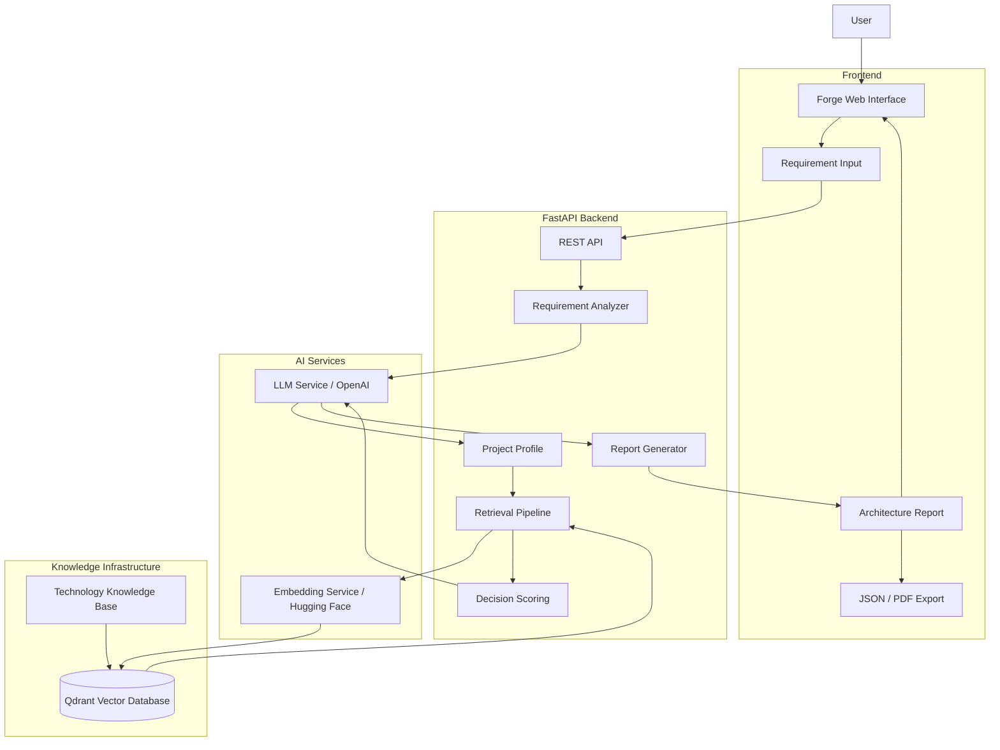
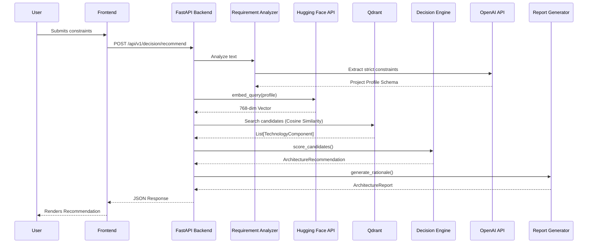
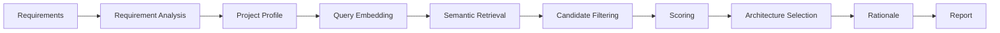
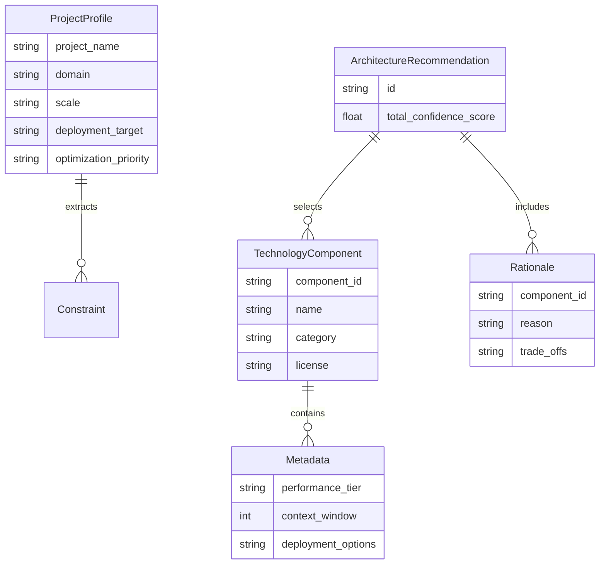
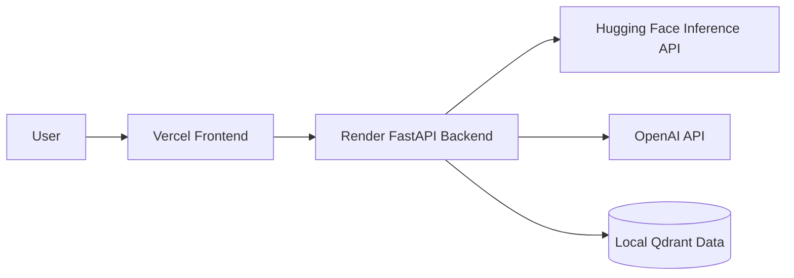

<p align="center">
  
</p>

<h1 align="center">Forge</h1>

<p align="center">
  AI Engineering Decision Support Platform
</p>

<p align="center">
  Forge transforms natural-language AI project requirements into evidence-backed architecture recommendations by analyzing constraints, retrieving relevant technologies, scoring alternatives, and generating a structured architecture report.
</p>

<p align="center">
  <a href="https://github.com/somiya-namdeo/Forge"></a>
  
  
  
  
  
  
</p>

<p align="center">
  <a href="https://forge-beta-gilt-16.vercel.app"></a>
  <a href="https://forge-mmz3.onrender.com"></a>
</p>

<p align="center">
  <a href="#overview">Overview</a> •
  <a href="#problem">Problem</a> •
  <a href="#solution">Solution</a> •
  <a href="#key-features">Key Features</a> •
  <a href="#architecture">Architecture</a> •
  <a href="#system-flow">System Flow</a> •
  <a href="#decision-pipeline">Decision Pipeline</a> •
  <a href="#technology-stack">Technology Stack</a> •
  <a href="#knowledge-base">Knowledge Base</a> •
  <a href="#retrieval--rag">Retrieval / RAG</a> •
  <a href="#evaluation">Evaluation</a> •
  <a href="#report-generation">Report Generation</a> •
  <a href="#database--data-model">Database / Data Model</a> •
  <a href="#api">API</a> •
  <a href="#local-development">Local Development</a>
</p>

---

## Table of Contents
- [Overview](#overview)
- [Problem](#problem)
- [Solution](#solution)
- [Key Features](#key-features)
- [Screenshots](#screenshots)
- [Architecture](#architecture)
- [System Flow](#system-flow)
- [Decision Pipeline](#decision-pipeline)
- [Technology Stack](#technology-stack)
- [Knowledge Base](#knowledge-base)
- [Retrieval / RAG](#retrieval--rag)
- [Evaluation](#evaluation)
- [Report Generation](#report-generation)
- [Database / Data Model](#database--data-model)
- [API](#api)
- [Project Structure](#project-structure)
- [Local Development](#local-development)
- [Environment Variables](#environment-variables)
- [Testing](#testing)
- [Deployment](#deployment)
- [Security](#security)
- [Limitations](#limitations)
- [Future Improvements](#future-improvements)
- [License](#license)

---

## Overview

Forge is an AI engineering decision-support platform designed to convert natural-language system requirements into structured, interoperable architecture recommendations.

When building a modern AI system, engineers must choose among many alternatives: LLMs, embedding models, vector databases, and retrieval strategies. The correct choice depends on strict constraints such as privacy, document volume, latency, and budget. Manually comparing these choices is difficult and time-consuming.

Forge automates this foundational architectural phase. Unlike a generic text-generation chatbot, Forge operates as a deterministic engineering co-pilot. It transforms natural language requirements into a Project Profile, uses Semantic Retrieval to fetch verified technology specifications, applies Constraint-Aware Scoring, and outputs a highly defensible Architecture Recommendation in a structured report.

## Problem

The AI engineering landscape shifts rapidly. Engineers face overwhelming fragmentation when selecting components for a Retrieval-Augmented Generation (RAG) or AI stack.

Evaluating the interplay of dozens of variables across multiple components—such as open-source requirements, enterprise security compliance, hardware limitations, and latency targets—often costs engineering teams weeks of upfront research before a single line of code is written.

## Solution

Forge provides an automated, evidence-backed decision pipeline:

1. **Requirement ingestion**: Accepts plain-language descriptions of the intended system.
2. **Requirement analysis**: Parses the intent into structured parameters.
3. **Constraint extraction**: Identifies hard blockers (e.g., "requires on-premise deployment").
4. **Project profile generation**: Constructs a unified project schema representing the workload.
5. **Semantic retrieval**: Embeds the profile and queries a vector knowledge base for relevant components.
6. **Candidate filtering**: Eliminates technologies that violate hard constraints.
7. **Decision scoring**: Evaluates remaining candidates against deterministic metrics.
8. **Architecture recommendation**: Selects the optimal combination of components.
9. **Technical rationale**: Generates explicit evidence explaining why each component was chosen.
10. **Report generation**: Aggregates the findings into a downloadable format.

## Key Features

| Capability | Description |
|---|---|
| Requirement Analysis | Parses unstructured user prompts into structured system constraints. |
| Project Profiling | Extracts scale, budget, and deployment targets deterministically. |
| Semantic Retrieval | Queries a vector database for technically viable technology candidates. |
| Constraint-Aware Scoring | Enforces hard blockers and scores trade-offs between competing components. |
| Technology Recommendation | Suggests a cohesive, interoperable AI stack. |
| Architecture Generation | Synthesizes individual component recommendations into a complete system design. |
| Technical Rationale | Provides explicit "why" and "why not" justifications for every selection. |
| Evaluation | Synthetically validates the retrieved rationale against the prompt. |
| JSON Export | Exposes the complete architecture recommendation payload for integrations. |
| PDF Export | Generates shareable ReportLab PDF files natively from the final architecture. |

## Screenshots

<p align="center">
  
</p>
<p align="center"><i>Main Forge UI — Describe an AI system and its engineering constraints in plain language.</i></p>

## Architecture

The system utilizes a decoupled microservice architecture, separating the client application from the heavy decision-engine orchestration.



## System Flow

This sequence diagram illustrates the synchronous request execution during an architecture recommendation.



## Decision Pipeline

Forge converts retrieved candidates into recommendations using a deterministic, multi-stage pipeline:

1. **Filtering**: The scoring engine applies hard filters based on the ProjectProfile. If a user requires an open-source model, proprietary APIs are immediately eliminated.
2. **Prioritization**: The engine applies weights derived from the user's optimization_priority (latency, cost, or quality).
3. **Scoring**: Remaining candidates are scored mathematically based on verified component metrics.
4. **Architecture Selection**: The highest-scoring combination of components is designated the winner.
5. **Rationale**: The engine compares the winning stack against runner-up components to generate explicit readable rationales.



<p align="center">
  
</p>
<p align="center"><i>Requirement Input and Decision Engine — Visualizing the deterministic filtering and scoring steps.</i></p>

## Technology Stack

| Layer | Technology | Purpose |
|---|---|---|
| Frontend | React / TypeScript / Vite | High-performance SPA rendering and strict type safety |
| Backend | FastAPI / Python 3.12 | High-throughput asynchronous REST API with Pydantic validation |
| AI / LLM | OpenAI / LangChain | Foundational intelligence and semantic requirement parsing |
| Embeddings | BAAI/bge-base-en-v1.5 | Semantic representation of requirements and profiles |
| Vector Database | Qdrant | Fast semantic similarity search and local profile storage |
| Knowledge Base | JSON Schemas | Structured, version-controlled technology definitions |
| Evaluation | RAGAS | Statistically robust generation validation against known ground truth |
| Reporting | ReportLab | Programmatic PDF document synthesis for exportable reports |
| Deployment | Vercel / Render | CI/CD enabled platforms for decoupled frontend/backend hosting |

## Knowledge Base

Forge stores engineering knowledge as structured JSON schemas embedded in Qdrant.

| Domain | Schema / Data | Purpose |
|---|---|---|
| LLM | Context window, licensing, parameters | Represents generative models for architectural inclusion |
| Embeddings | Dimensionality, sequence length | Represents embedding models for search capabilities |
| Vector Databases | Indexing support, latency tiers | Represents storage engines for semantic search |

**Core Metadata Fields:**
The schemas enforce fields such as `id`, `name`, `category`, `license`, `cost_indicator`, `performance_tier`, `context_window`, and `deployment_options` to ensure deterministic scoring.

<p align="center">
  
</p>
<p align="center"><i>Knowledge Base Interface — Viewing the registered technology components used for recommendation scoring.</i></p>

## Retrieval / RAG

Forge implements a specialized retrieval pipeline designed for engineering decision-making:

- **Query Encoding**: User requirements are summarized and encoded.
- **Embedding API**: Forge utilizes a remote embedding architecture via BAAI/bge-base-en-v1.5 through the Hugging Face InferenceClient. This offloads heavy PyTorch compute, keeping the FastAPI backend lightweight.
- **Vector Dimensions**: 768-dimensional representations are generated.
- **Similarity Search**: Qdrant executes cosine-similarity matching to fetch candidates that architecturally align with the prompt.
- **Filtering & Scoring**: Retrieved components are filtered for strict compliance and passed to the scoring engine.

## Evaluation

Forge includes a synthetic evaluation engine powered by the RAGAS framework. This validates the quality of the architecture recommendation by scoring the generated response against the retrieved context.

<p align="center">
  
</p>
<p align="center"><i>Evaluation Pipeline — The interface compares the Evaluation Input (Question), Retrieved Context, Ground Truth, and Generated Answer to calculate Faithfulness and Answer Relevancy.</i></p>

## Report Generation

The backend aggregates all decision signals and technical rationales into a final ArchitectureReport.

- **Report Structure**: Includes decision signals, the selected architecture components, recommendations, and deep technical rationale.
- **JSON Export**: The structured data is returned to the frontend for UI rendering.
- **PDF Generation**: The FastAPI backend utilizes ReportLab to programmatically format the JSON data into a binary PDF response, allowing browser downloads.

<p align="center">
  
</p>
<p align="center"><i>Generated Architecture Report — Visualizing the selected components and rationales.</i></p>

<p align="center">
  
</p>
<p align="center"><i>PDF Output — The finalized architecture design natively exported for engineering distribution.</i></p>

## Database / Data Model

Forge does not use a relational database (e.g., PostgreSQL or Supabase). All persistent application data and technology profiles reside directly in Qdrant as semantic vectors with rich payload metadata, validated strictly in-memory using Pydantic schemas.

| Storage Layer | Technology | Purpose |
|---|---|---|
| Vector Store | Qdrant | Embeddings and semantic search execution |
| Structured Data | Qdrant (Payloads) | Technology specifications and constraints attached to vectors |
| Application Data | Pydantic (In-Memory) | Ephemeral request/response state and report generation |



## API

The FastAPI backend exposes the following core endpoints:

| Method | Endpoint | Purpose |
|---|---|---|
| POST | /api/v1/decision/recommend | Generates architecture recommendations and rationale from requirements. |
| GET | /api/v1/knowledge | Retrieves paginated specifications of registered AI technologies. |
| POST | /api/v1/reports/generate | Generates a structured JSON architecture decision report. |
| POST | /api/v1/reports/pdf | Generates the architecture report as a binary PDF download. |
| POST | /api/v1/evaluation/evaluate | Runs Ragas metrics against a provided architecture recommendation. |

**Example Request (/api/v1/decision/recommend):**
```json
{
  "description": "I need an open-source, highly secure RAG system for medical documents with low latency."
}
```

## Project Structure

```text
Forge/
├── app/
│   ├── api/
│   ├── core/
│   ├── decision/
│   ├── embeddings/
│   ├── evaluation/
│   ├── reports/
│   ├── retriever/
│   ├── schemas/
│   └── services/
├── docs/
│   └── screenshots/
├── frontend/
│   ├── public/
│   └── src/
│       ├── components/
│       ├── context/
│       ├── pages/
│       └── services/
├── knowledge_base/
├── tests/
├── .env.example
├── requirements.txt
└── README.md
```

| Directory | Purpose |
|---|---|
| app/ | Contains the complete Python FastAPI application and core logic. |
| frontend/ | Contains the React web application utilizing Vite. |
| knowledge_base/ | Stores the local Qdrant collections and embedded vector data. |
| tests/ | Contains the comprehensive pytest validation suite. |

## Local Development

### Clone repository
```bash
git clone https://github.com/somiya-namdeo/Forge.git
cd Forge
```

### Backend Setup

Create and activate the virtual environment:
```bash
# macOS/Linux
python -m venv .venv
source .venv/bin/activate

# Windows PowerShell
python -m venv .venv
.venv\Scripts\activate
```

Install dependencies:
```bash
pip install -r requirements.txt
```

### Frontend Setup
```bash
cd frontend
npm install
```

### Start Backend
```bash
uvicorn app.main:app --reload --port 8000
```

### Start Frontend
```bash
npm run dev
```

## Environment Variables

Create a .env file in the root directory. Do not commit actual secrets.

| Variable | Required | Purpose | Example |
|---|---|---|---|
| OPENAI_API_KEY | Yes | Requirement extraction and rationale generation | sk-your_openai_api_key |
| HUGGINGFACEHUB_API_TOKEN | Yes | Remote embedding generation | hf_your_huggingface_token |
| EMBEDDING_MODEL | No | Overrides the default embedding model | BAAI/bge-base-en-v1.5 |
| FRONTEND_URL | No | Configures CORS for the backend | http://localhost:5173 |

## Testing

The backend includes a comprehensive pytest suite covering decision scoring, API endpoints, and retrieval logic. The repository currently maintains 25 active tests.

To run the test suite:
```bash
pytest tests/
```

## Deployment

The application utilizes a decoupled deployment architecture:



- **Frontend**: Deployed on Vercel.
- **Backend**: Deployed on Render.
- **Inference**: Offloaded to Hugging Face and OpenAI to maintain a lightweight Render footprint.

## Security

- environment-based secret management
- API authentication to external services
- request validation
- CORS
- no secrets committed
- input validation

## Limitations

- dependency on external inference services
- network/API availability
- knowledge base coverage
- recommendation quality depending on knowledge quality

## Future Improvements

- stronger evaluation
- reranking
- expanded knowledge coverage
- observability
- caching
- authentication
- scalability
- richer decision explanations

## License

MIT License