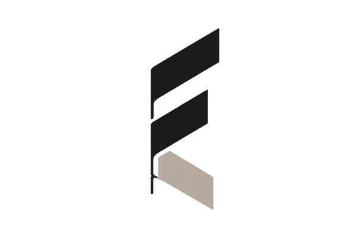
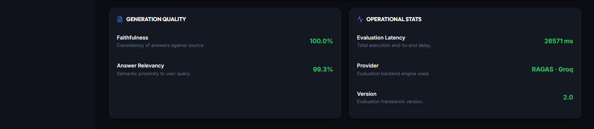
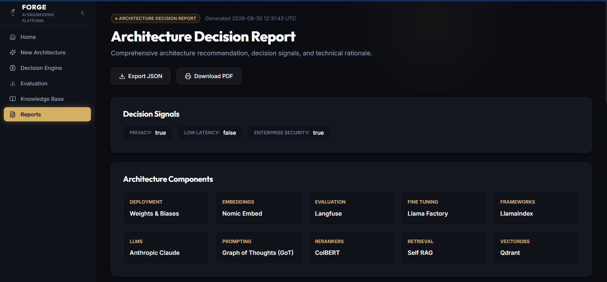

  
  <h1>Forge</h1>
  
<em>Every Great System Starts with the Right Draft.</em>

 

  <a href="https://forge-beta-gilt-16.vercel.app"><strong>Live Demo (Frontend)</strong></a> •
  <a href="https://forge-mmz3.onrender.com"><strong>Backend API</strong></a> •
  <a href="https://github.com/somiya-namdeo/Forge"><strong>Source Code</strong></a>

## What I Made (The Story Behind Forge)

Building a modern AI or Retrieval-Augmented Generation (RAG) system is incredibly complex. Whenever engineers sit down to design a new AI stack, they are hit with an overwhelming number of choices: *Which LLM fits this budget? Which vector database handles this scale? Which embedding model is best for this domain?*

Engineers often spend weeks reading documentation and benchmarking models just to select the right stack. **I wanted to automate this foundational architectural phase.**

So, I built **Forge**.

Forge is an enterprise-grade AI Architecture Decision Engine. Instead of manually researching technologies, you simply describe your system requirements in natural language (e.g., *"I need an open-source, highly secure RAG system for medical documents with low latency"*). Forge semantically searches a curated knowledge base of AI components, evaluates alternatives against your strict constraints, reasons about trade-offs, and generates a structured, defensible engineering decision report. It doesn't just give you a generic chatbot response; it acts as a deterministic engineering co-pilot.

## How I Made It (The Architecture)

To make Forge reliable and robust, I couldn't rely on a simple LLM wrapper. The system needed to process hard constraints (like budget and deployment targets) and compare them against real-world specifications.

I designed the architecture around a **Semantic Retrieval Pipeline** backing a **Deterministic Decision Engine**.

### 1. Vectorizing the Knowledge Base
Instead of using a traditional SQL database, **all technology specifications are stored natively as high-dimensional vectors in Qdrant**. When Forge boots up, it ingests JSON profiles of LLMs, vector stores, and embedding models, converting their specifications into semantic vectors using the Hugging Face Inference API (BAAI/bge-base-en-v1.5).

### 2. The Decision Engine Pipeline
When a user submits a prompt, Forge executes a strict multi-step pipeline:
1. **Requirement Extraction**: Parses the raw prompt to extract scale, budget, and deployment constraints.
2. **Knowledge Retrieval**: Embeds the user's requirements and performs a cosine-similarity search in Qdrant to fetch the most capable technologies.
3. **Candidate Scoring**: A custom scoring matrix applies hard filters (e.g., dropping SaaS models if on-premise is required) and scores the remaining candidates based on trade-offs.
4. **Evaluation**: I integrated the **RAGAS framework** to synthetically validate the rationale (Faithfulness) and the final recommendation (Answer Relevancy).
5. **PDF Export**: The final report is piped through ReportLab to generate a professional engineering PDF.

### System Flow
\\\mermaid
sequenceDiagram
    participant User as User
    participant API as FastAPI Backend
    participant HF as Hugging Face API
    participant QD as Qdrant Vector DB
    participant DE as Decision Engine

    User->>API: Submits natural language requirements
    API->>API: Extract constraints & project profile
    API->>HF: embed_query(project_profile)
    HF-->>API: Returns 768-dim Vector
    API->>QD: query(vector, top_k=10)
    QD-->>API: Returns valid technology components
    API->>DE: score_candidates(components, constraints)
    DE-->>API: Generates architecture & rationale
    API-->>User: Returns structured Architecture Report
\\\

## What I Used (Tech Stack)

I carefully selected the tech stack to balance high performance, strict type validation, and lightweight deployment capabilities.

### Application & Infrastructure
| Layer | Technology | Why I Chose It |
| :--- | :--- | :--- |
| **Frontend** | React, TypeScript, Vite, Tailwind CSS | Provides a highly responsive, modular SPA with strict type safety matching the backend. |
| **Backend Core** | FastAPI, Python 3.12, Pydantic | High-throughput asynchronous REST API with rigid schema validation. |
| **Hosting** | Vercel (Frontend) & Render (Backend) | CI/CD enabled platforms for seamless, decoupled deployment. |

### AI, Machine Learning & Databases
| Layer | Technology | Why I Chose It |
| :--- | :--- | :--- |
| **Vector Database** | Qdrant | Fast, local-capable semantic similarity search without needing complex relational DBs. |
| **Embeddings** | Hugging Face Inference API | Serverless embeddings (BAAI/bge-base-en-v1.5) keeps the backend completely lightweight without local PyTorch overhead. |
| **Intelligence** | OpenAI & LangChain | Orchestrates the prompt construction and rationale extraction. |
| **Evaluation** | RAGAS Framework | Provides statistically robust metrics (Faithfulness, Relevancy) rather than subjective vibes. |
| **Reporting** | ReportLab | Programmatically generates clean, shareable PDFs of the final decisions. |

## Core API Endpoints

The FastAPI backend exposes several core capabilities cleanly:

| Method | Endpoint | Purpose |
| :--- | :--- | :--- |
| POST | /api/v1/decision/recommend | Parses requirements, retrieves knowledge, and generates the architecture recommendation. |
| GET | /api/v1/knowledge | Retrieves paginated specifications of all registered AI technologies from Qdrant. |
| POST | /api/v1/reports/pdf | Converts a generated architecture JSON payload into a downloadable PDF binary. |
| POST | /api/v1/evaluation/evaluate | Runs Ragas metrics against a provided architecture recommendation. |

## Screenshots & Walkthrough

Here is a visual walkthrough of the platform I built:

### 1. Landing Page & Requirements Input

  
  
<i>Users start by defining their AI system constraints in plain natural language.</i>

### 2. Architecture Decision Report

  
    
  
  
<i>Forge outputs a deep technical rationale, analyzing why a component was chosen and why alternatives were rejected.</i>

### 3. Decision Engine & Trade-offs

  
  
<i>The engine explicitly scores cost, latency, and compliance across candidates.</i>

### 4. RAGAS Quality Evaluation

  
    
  
  
<i>Validating the proposed architecture against real-world QA contexts using robust evaluation metrics.</i>

### 5. Exportable Engineering Reports

  
    
  
  
<i>The final architecture can be natively exported to JSON or a polished PDF.</i>

### 6. Knowledge Base Explorer

  
  
<i>The underlying Qdrant vector store where all technology specs are maintained.</i>

## Local Development Setup

Want to run this yourself? Here is how to get it started locally:

### 1. Clone the Repository
\\\ash
git clone https://github.com/somiya-namdeo/Forge.git
cd Forge
\\\

### 2. Backend Setup
\\\ash
# Create and activate virtual environment (Python 3.12+)
python -m venv .venv
source .venv/bin/activate  # On Windows: .venv\Scripts\activate

# Install dependencies
pip install -r requirements.txt
\\\

### 3. Frontend Setup
\\\ash
cd frontend
npm install
\\\

### 4. Environment Variables
Create a .env file in the root orge/ directory:
\\\env
OPENAI_API_KEY=your_openai_api_key
HUGGINGFACEHUB_API_TOKEN=your_hf_token
FRONTEND_URL=http://localhost:5173
\\\

### 5. Running the Application
**Backend:**
\\\ash
# From the repository root
uvicorn app.main:app --reload --port 8000
\\\

**Frontend:**
\\\ash
# In the frontend/ directory
npm run dev
\\\

### 6. Testing
I built a comprehensive pytest suite covering the decision scoring, API endpoints, and retrieval logic:
\\\ash
pytest tests/
\\\

## License
Distributed under the MIT License.