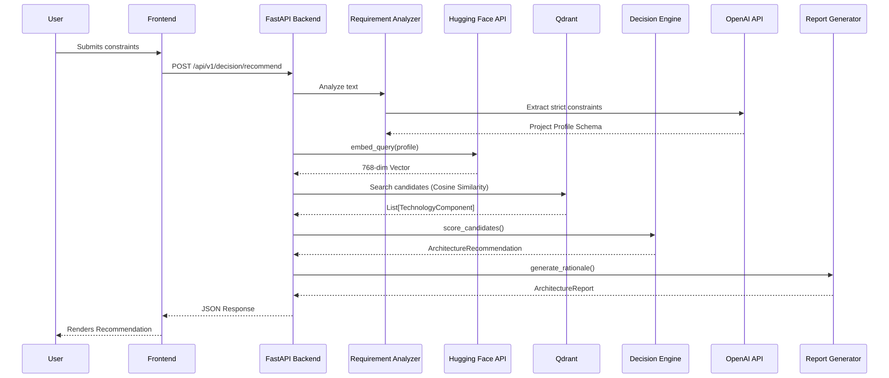
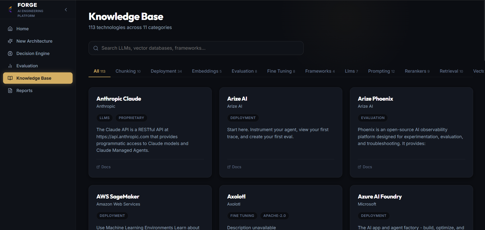

<div align="center">
  

# Forge

### AI Engineering Decision Support Platform

Evidence-backed architecture recommendations from natural-language AI system requirements.

[](https://python.org)
[](https://fastapi.tiangolo.com)
[](https://reactjs.org)
[](https://www.typescriptlang.org)
[](https://qdrant.tech)
[](https://huggingface.co)
[](https://openai.com)
[](https://vercel.com)
[](https://render.com)

[GitHub Repository](https://github.com/somiya-namdeo/Forge) • [Live Demo](https://forge-beta-gilt-16.vercel.app) • [API Backend](https://forge-mmz3.onrender.com)

</div>

---

## Table of Contents
- [Overview](#overview)
- [Key Capabilities](#key-capabilities)
- [Technology Stack](#technology-stack)
- [System Architecture](#system-architecture)
- [End-to-End System Flow](#end-to-end-system-flow)
- [Request Sequence](#request-sequence)
- [Decision Engine](#decision-engine)
- [Knowledge Base and Retrieval](#knowledge-base-and-retrieval)
- [Data Model and Vector Storage](#data-model-and-vector-storage)
- [Evaluation](#evaluation)
- [Generated Architecture Report](#generated-architecture-report)
- [PDF Generation](#pdf-generation)
- [Deployment Architecture](#deployment-architecture)
- [API](#api)
- [Environment Variables](#environment-variables)
- [Local Development](#local-development)
- [Testing](#testing)
- [Project Structure](#project-structure)
- [Engineering Design Decisions](#engineering-design-decisions)
- [Security](#security)
- [Limitations](#limitations)
- [Future Improvements](#future-improvements)
- [License](#license)

---

## Overview

Forge is an AI engineering decision-support platform designed to convert natural-language system requirements into structured, interoperable architecture recommendations.

When building a modern AI system, engineers must choose among many alternatives: LLMs, embedding models, vector databases, and retrieval strategies. The correct choice depends on strict constraints such as privacy, document volume, latency, and budget. Manually comparing these choices is difficult and time-consuming.

Forge automates this foundational architectural phase. Unlike a generic text-generation chatbot, Forge operates as a deterministic engineering co-pilot. It transforms natural language requirements into a structured Project Profile, uses Semantic Retrieval to fetch verified technology specifications from Qdrant, applies Constraint-Aware Scoring, and outputs a highly defensible Architecture Recommendation alongside explicit trade-off rationale in a structured JSON or exportable PDF report.

<p align="center">
  
</p>

## Key Capabilities

| Capability | Description |
|---|---|
| Natural-language requirement analysis | Parses unstructured user prompts into structured constraints using LLMs. |
| Constraint extraction | Identifies strict engineering blockers (e.g., privacy mandates, on-premise requirements). |
| Project profiling | Extracts scale, budget, and deployment targets deterministically. |
| Semantic technology retrieval | Queries a vector database for technically viable technology candidates. |
| Candidate filtering | Eliminates incompatible technologies before scoring begins. |
| Decision scoring | Analyzes trade-offs between competing LLMs, vector stores, and embedders using weighted matrices. |
| Architecture selection | Suggests a cohesive, interoperable AI stack prioritizing the user's constraints. |
| Rationale generation | Generates explicit "why" and "why not" justifications for every selected component. |
| Evaluation | Synthetically validates the retrieved rationale against the prompt using the RAGAS framework. |
| JSON export | Exposes the complete architecture recommendation payload via REST APIs. |
| PDF report generation | Programmatically synthesizes shareable PDF documents using ReportLab. |

## Technology Stack

| Layer | Technology | Purpose |
|---|---|---|
| Frontend | React, TypeScript, Vite, Tailwind CSS | High-performance SPA rendering and strict type safety |
| Backend | FastAPI, Python 3.12 | High-throughput async REST API with rigid Pydantic schema validation |
| Embeddings | BAAI/bge-base-en-v1.5 | 768-dimensional semantic representation of requirements and profiles |
| Embedding Provider | Hugging Face Inference API | Remote embedding generation to maintain a lightweight API footprint |
| Vector Database | Qdrant | Fast semantic similarity search and local technology profile storage |
| LLM | OpenAI | Foundational intelligence for requirement parsing and rationale synthesis |
| Decision Engine | Python (Custom Deterministic Scoring) | Explicit mathematical scoring of architecture candidate trade-offs |
| Validation | RAGAS | Statistically robust generation validation against known ground truth |
| PDF Generation | ReportLab | Programmatic PDF document synthesis |
| Testing | Pytest | Comprehensive unit and integration test execution |
| Deployment | Vercel (Frontend), Render (Backend) | CI/CD enabled platforms for decoupled microservice hosting |

## System Architecture

<p align="center">
  
</p>

| Layer | Component | Responsibility |
|---|---|---|
| Client | React SPA (Vercel) | Renders the web interface and handles user inputs/exports. |
| API | FastAPI Router (Render) | Exposes REST endpoints and orchestrates the backend pipeline. |
| Analysis | Requirement Analyzer | Parses user prompts into structured project profiles via OpenAI. |
| Knowledge | Qdrant Vector Database | Stores technology schemas and semantic vectors locally. |
| Engine | Decision Scoring | Filters candidates and calculates weighted scores based on constraints. |
| Services | Hugging Face / OpenAI | External providers for embeddings and text generation. |

## End-to-End System Flow

<p align="center">
  
</p>

1. **User input**: The user enters natural-language requirements in the React frontend.
2. **API request**: The frontend sends a POST request to the FastAPI backend.
3. **Requirement analysis**: The backend analyzes the requirements using an LLM.
4. **Project profile**: A structured project profile (constraints, scale, budget) is created.
5. **Query embedding**: The requirement summary is embedded via the Hugging Face API (BAAI/bge-base-en-v1.5).
6. **Semantic retrieval**: Qdrant executes a cosine-similarity search against the knowledge base.
7. **Candidate filtering**: The backend filters out components that violate hard constraints.
8. **Decision scoring**: Remaining technologies are scored based on priorities (cost vs. latency vs. quality).
9. **Architecture selection**: The top-scoring components are selected to form a stack.
10. **Rationale generation**: An LLM synthesizes the engineering trade-offs into readable justifications.
11. **Report generation**: The structured architecture report is returned to the frontend.

## Request Sequence

<p align="center">
  
</p>

This sequence demonstrates the synchronous execution pipeline for the `/api/v1/decision/recommend` endpoint. The process coordinates multiple external API boundaries (Hugging Face, OpenAI) and local storage (Qdrant) to compile a deterministic response.

## Decision Engine

<p align="center">
  
</p>

The core of Forge is the deterministic decision pipeline. Unlike LLM text generators, Forge does not rely on probability to guess an architecture. It leverages explicitly retrieved facts.

- **Constraint Filtering**: Identifies binary flags (e.g., open-source requirements) and drops candidates that fail the check.
- **Candidate Retrieval**: Fetches top K related technologies from Qdrant based on vector similarity.
- **Scoring**: Applies multipliers to the candidates' known indicators based on optimization priorities.
- **Optimization Priority**: If latency is prioritized, latency metrics receive a significant score multiplier.
- **Architecture Selection**: Selects the absolute highest numerical score for each category.
- **Rationale Generation**: Passes the winning component and the runner-up components to the LLM to explain the engineering compromise.

## Knowledge Base and Retrieval

<p align="center">
  
</p>

Forge stores its engineering knowledge as structured JSON schemas embedded in Qdrant across three main domains: **LLMs**, **Embeddings**, and **Vector Databases**.

The application encodes incoming profiles into 768-dimensional vectors. Rather than executing a local PyTorch `SentenceTransformer` (which exceeds typical cloud free-tier memory limits), Forge routes text to the Hugging Face Inference API using `BAAI/bge-base-en-v1.5`. The returned vector is then used to perform a cosine-similarity search against the local Qdrant collections.

## Data Model and Vector Storage

<p align="center">
  
</p>

Forge strictly avoids traditional relational databases (like PostgreSQL). All persistent data structures reside in Qdrant as semantic vectors with rich payload metadata, validated in memory via Pydantic schemas.

| Storage Layer | Technology | Purpose |
|---|---|---|
| Vector Store | Qdrant | Embeddings and semantic search execution |
| Structured Data | Qdrant (Payloads) | Technology specifications and constraints attached to vectors |
| Application Data | Pydantic (In-Memory) | Ephemeral request/response state and report generation |

## Evaluation

<p align="center">
  
</p>

Forge includes an explicit synthetic evaluation engine powered by the RAGAS framework. The evaluation interface compares the Evaluation Input, Retrieved Context, Ground Truth, and Generated Answer to calculate Faithfulness and Answer Relevancy metrics, ensuring recommendations remain factually anchored to the Qdrant knowledge base.

## Generated Architecture Report

<p align="center">
  
</p>

The backend aggregates all decision signals and technical rationales into a final structured Architecture Report. This payload includes the extracted decision signals, the selected architecture components, technical recommendations, and deep trade-off rationale. It is available directly in the frontend UI or as a raw JSON export.

## PDF Generation

<p align="center">
  
</p>

Recommendations can be natively exported as a structured engineering PDF artifact. The FastAPI backend utilizes the Python `reportlab` library to programmatically draw the document based on the report payload, returning it as a binary stream for frontend download.

## Deployment Architecture

<p align="center">
  
</p>

The application utilizes a decoupled microservice deployment architecture, distributing the frontend to Vercel and the backend to Render, while securely proxying external inference services (Hugging Face, OpenAI).

## API

The FastAPI backend exposes the following core endpoints:

| Method | Endpoint | Purpose |
|---|---|---|
| `POST` | `/api/v1/decision/recommend` | Generates architecture recommendations and rationale from requirements. |
| `GET` | `/api/v1/knowledge` | Retrieves paginated specifications of registered AI technologies. |
| `POST` | `/api/v1/reports/generate` | Generates a structured JSON architecture decision report. |
| `POST` | `/api/v1/reports/pdf` | Generates the architecture report as a binary PDF download. |
| `POST` | `/api/v1/evaluation/evaluate` | Runs RAGAS metrics against a provided architecture recommendation. |

## Environment Variables

| Variable | Required | Purpose | Example |
|---|---|---|---|
| `OPENAI_API_KEY` | Yes | Requirement extraction and rationale generation | `sk-your_openai_api_key` |
| `HUGGINGFACEHUB_API_TOKEN` | Yes | Remote embedding generation | `hf_your_huggingface_token` |
| `EMBEDDING_MODEL` | No | Overrides the default embedding model | `BAAI/bge-base-en-v1.5` |
| `FRONTEND_URL` | No | Configures CORS for the backend | `http://localhost:5173` |

## Local Development

```bash
git clone https://github.com/somiya-namdeo/Forge.git
cd Forge
```

**Backend Setup:**

Unix/macOS:
```bash
python -m venv .venv
source .venv/bin/activate
pip install -r requirements.txt
uvicorn app.main:app --reload --port 8000
```

Windows:
```bash
python -m venv .venv
.venv\Scripts\Activate.ps1
pip install -r requirements.txt
uvicorn app.main:app --reload --port 8000
```

**Frontend Setup:**
```bash
cd frontend
npm install
npm run dev
```

## Testing

The backend includes a comprehensive pytest suite covering decision scoring, API endpoints, and retrieval logic. The repository currently maintains 25 passing tests.

| Area | Tool | Coverage/Role |
|---|---|---|
| Decision Engine | pytest | Scoring algorithms, filtering logic |
| API Routes | pytest | Request validation, payload structures |
| Retrieval | pytest | Mocked semantic similarity evaluation |

To run the test suite:
```bash
pytest tests/
```

## Project Structure

```text
Forge/
├── app/
│   ├── api/
│   ├── core/
│   ├── decision/
│   ├── embeddings/
│   ├── evaluation/
│   ├── reports/
│   ├── retriever/
│   └── schemas/
├── docs/
│   ├── diagrams/
│   └── screenshots/
├── frontend/
│   ├── public/
│   └── src/
│       ├── components/
│       ├── pages/
│       └── services/
├── knowledge_base/
├── tests/
├── .env.example
├── requirements.txt
└── README.md
```

## Engineering Design Decisions

- **API-based embeddings instead of local heavy embedding inference**: Forge offloads the `BAAI/bge-base-en-v1.5` workload to Hugging Face rather than running local PyTorch `SentenceTransformer` binaries, keeping the Render free-tier compute lightweight.
- **Qdrant semantic retrieval**: Bypassing a traditional relational database simplifies deployment and allows unstructured documentation to be seamlessly embedded alongside structured capability limits.
- **Separation of retrieval and decision scoring**: Enforces rigid boundaries between the LLM output and the deterministic scoring engine to prevent hallucination bleeding.
- **Deployment separation**: Hosting the frontend on Vercel and the backend on Render provides scalable CI/CD pipelines independent of one another.

## Security

- **Environment variables**: All tokens are managed via `.env` strictly isolated from source control.
- **API boundaries**: External inference services are only accessible via the backend proxy.
- **CORS**: Enforced at the FastAPI layer, restricting origins to the Vercel frontend.
- **No secrets committed to Git**: `.env.example` enforces safe template usage.

## Limitations

- Dependency on external inference APIs (Hugging Face and OpenAI) ties recommendation latency to their availability.
- Recommendation quality is highly dependent on the breadth and freshness of the technology specifications stored locally in Qdrant.

## Future Improvements

- Automated knowledge base refreshing pipelines for technology specifications.
- Reranking implementation (e.g., Cohere or BGE-Reranker) to refine candidate selection accuracy.
- Expanded observability via telemetry and trace logging for scoring transparency.

## License

MIT License