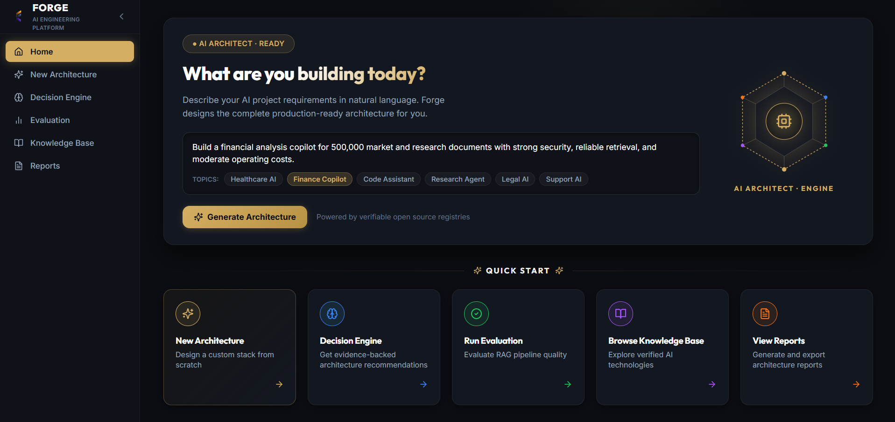
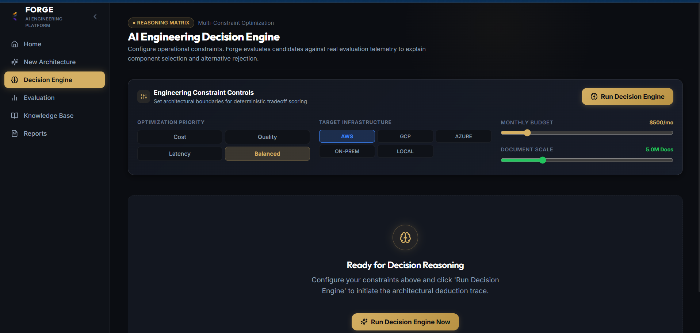
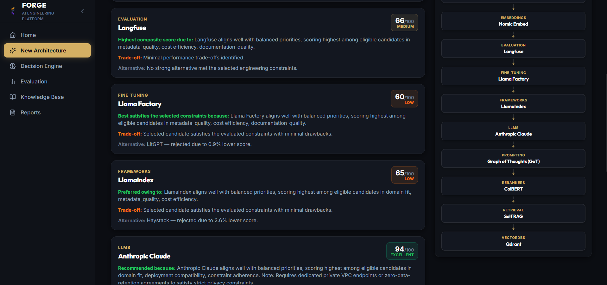
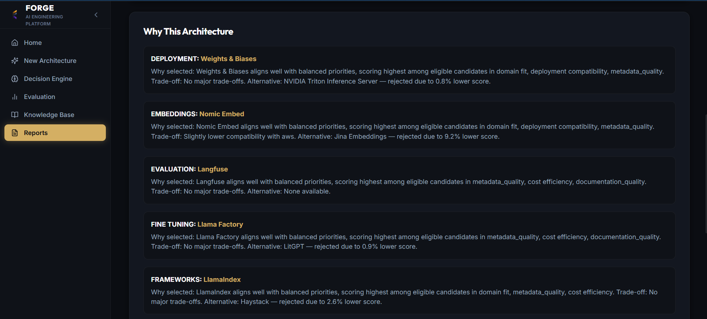
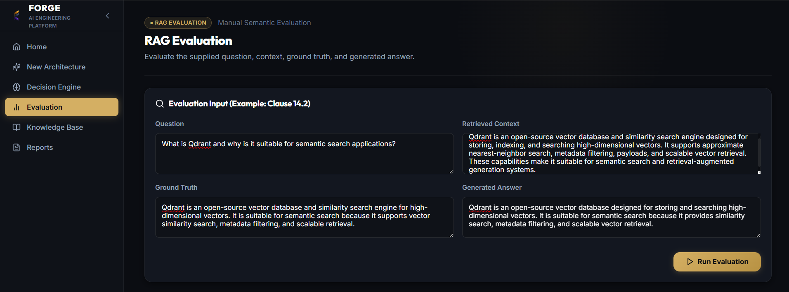

# Forge

### AI Engineering Decision Support Platform

Forge is an AI engineering decision-support platform that transforms natural-language system requirements into structured, evidence-backed architecture recommendations. By retrieving real-world engineering constraints from a vector knowledge base and applying deterministic scoring, Forge reasons about trade-offs and produces a comprehensive architecture decision report.

[Live Demo](https://forge-beta-gilt-16.vercel.app) | [GitHub Repository](https://github.com/somiya-namdeo/Forge) | [Backend API](https://forge-mmz3.onrender.com)

---

## Table of Contents
- [Overview](#overview)
- [Problem](#problem)
- [Solution](#solution)
- [Key Capabilities](#key-capabilities)
- [System Architecture](#system-architecture)
  - [High-Level Architecture](#high-level-architecture)
  - [System Flow](#system-flow)
  - [Recommendation Sequence](#recommendation-sequence)
- [Data and Knowledge Architecture](#data-and-knowledge-architecture)
  - [Retrieval Architecture](#retrieval-architecture)
  - [Knowledge Data Model](#knowledge-data-model)
- [Decision Pipeline](#decision-pipeline)
- [Embedding Architecture](#embedding-architecture)
- [Report Generation](#report-generation)
- [Evaluation](#evaluation)
- [Technology Stack](#technology-stack)
- [API Overview](#api-overview)
- [Project Structure](#project-structure)
- [Local Development](#local-development)
- [Testing](#testing)
- [Deployment](#deployment)
- [Engineering Design Decisions](#engineering-design-decisions)
- [Limitations](#limitations)
- [Future Improvements](#future-improvements)
- [License](#license)

---

## Overview

Forge is an AI engineering decision-support platform that converts natural-language system requirements into structured architecture recommendations.

The complete high-level lifecycle executes as follows:

User requirements &rarr; requirement analysis &rarr; project profile &rarr; constraint detection &rarr; embedding generation &rarr; knowledge retrieval &rarr; candidate technologies &rarr; scoring and recommendation &rarr; architecture synthesis &rarr; structured report &rarr; optional PDF export.

This platform operates as a deterministic engineering co-pilot. Rather than relying on generic LLM probabilities, Forge grounds its decisions in verified technology specifications, explicitly scoring trade-offs such as latency, cost, and deployment constraints to output a highly defensible engineering draft.

  

<i>Natural-Language Requirements — Describe an AI system and its engineering constraints in plain language.</i>

## Problem

When building an AI, LLM, or Retrieval-Augmented Generation (RAG) system, engineers must choose among many alternatives:

- LLMs
- embedding models
- vector databases
- retrieval strategies
- rerankers
- frameworks
- deployment approaches

The correct choice depends on strict project constraints such as:

- privacy and compliance
- document volume and scale
- latency requirements
- budget and cost
- deployment target (e.g., on-premise vs. SaaS)
- open-source requirements
- output quality requirements

Manually comparing these choices is difficult. Technology landscapes shift weekly, documentation is fragmented, and evaluating the interplay of dozens of variables across multiple components often costs engineering teams weeks of upfront research before a single line of code is written.

## Solution

Forge addresses this research bottleneck through an automated, evidence-backed decision pipeline:

1. **Requirement ingestion**: Accepts plain-language descriptions of the intended system.
2. **Requirement analysis**: Uses an LLM to parse the intent into structured parameters.
3. **Constraint extraction**: Identifies hard blockers (e.g., "must be open source").
4. **Project profile generation**: Constructs a unified project schema representing the workload.
5. **Semantic retrieval**: Embeds the profile and queries the Qdrant knowledge base for relevant components.
6. **Candidate filtering**: Eliminates technologies that violate hard constraints.
7. **Decision scoring**: Evaluates remaining candidates against a deterministic matrix (cost vs. latency vs. scale).
8. **Architecture recommendation**: Selects the optimal combination of components.
9. **Technical rationale**: Generates explicit evidence explaining why each component was chosen and why alternatives were rejected.
10. **Report generation**: Aggregates the findings into a downloadable JSON or PDF document.

## Key Capabilities

| Capability | Description |
|---|---|
| **Natural-language requirements** | Converts unstructured user prompts into structured system constraints. |
| **Requirement analysis** | Extracts scale, budget, and deployment targets deterministically. |
| **Constraint detection** | Enforces hard blockers such as privacy mandates or cloud-agnostic requirements. |
| **Semantic retrieval** | Queries a vector database for technically viable technology candidates. |
| **Technology comparison** | Analyzes the trade-offs between competing LLMs, vector stores, and embedders. |
| **Decision scoring** | Ranks candidates using weighted matrices prioritizing latency, cost, or quality. |
| **Architecture recommendation** | Suggests a cohesive, interoperable AI stack. |
| **Evidence-backed reasoning** | Provides explicit "why" and "why not" rationales for every selection. |
| **Report generation** | Compiles unified architecture decision documents. |
| **PDF export** | Exports decisions to shareable ReportLab PDF files natively. |

## System Architecture

### High-Level Architecture

The system utilizes a modern decoupled architecture, separating the client application from the heavy decision-engine microservices.

\\\mermaid
flowchart TB
    subgraph Client Layer
        Frontend[React SPA]
    end

    subgraph API Layer
        FastAPI[FastAPI Router]
    end

    subgraph Decision Engine
        RA[Requirement Analyzer]
        RE[Recommendation Engine]
        TR[Trade-off Analyzer]
    end

    subgraph AI and Retrieval Layer
        ES[Embedding Service]
        RET[Qdrant Retriever]
    end

    subgraph Knowledge Layer
        QD[(Qdrant Vector DB)]
    end

    subgraph External Services
        HF[Hugging Face Inference API]
        OAI[OpenAI / LLM API]
    end

    subgraph Presentation Layer
        RG[Report Generator]
        PDF[PDF Export Service]
    end

    Frontend -->|HTTP Requests| FastAPI
    FastAPI --> RA
    FastAPI --> RE
    FastAPI --> RG

    RA --> OAI
    RE --> TR
    RE --> RET

    RET --> ES
    ES --> HF
    RET --> QD

    RG --> PDF
\\\

### System Flow

The end-to-end request flow traces a user requirement through semantic translation, retrieval, and scoring.

\\\mermaid
flowchart TD
    User([User]) -->|enters project requirements| Frontend[React Frontend]
    Frontend -->|POST /decision/recommend| API[FastAPI]
    API --> RA[Requirement Analyzer]
    RA --> PP[Project Profile]
    PP --> ES[Embedding Generation]
    ES -->|Hugging Face API| Vec[768-dim Vector]
    Vec --> QD[Qdrant Semantic Retrieval]
    QD --> CT[Candidate Technologies]
    CT --> DS[Decision Scoring & Filtering]
    DS --> Rec[Architecture Recommendation]
    Rec --> AR[Architecture Report]
    AR -->|JSON Response| Frontend
    Frontend -->|Renders UI| User
\\\

### Recommendation Sequence

This sequence diagram illustrates the synchronous processes and external API boundaries during a recommendation request.

\\\mermaid
sequenceDiagram
    participant Frontend
    participant FastAPI
    participant Analyzer as Requirement Analyzer
    participant Embedder as Embedding Service
    participant HuggingFace as Hugging Face API
    participant Retriever as Qdrant Retriever
    participant Engine as Decision Engine

    Frontend->>FastAPI: POST /api/v1/decision/recommend
    FastAPI->>Analyzer: extract_profile(prompt)
    Analyzer-->>FastAPI: ProjectProfile (Constraints)
    FastAPI->>Embedder: embed_query(profile_summary)
    Embedder->>HuggingFace: feature_extraction(text)
    HuggingFace-->>Embedder: 768-dim Vector
    Embedder-->>FastAPI: Vector
    FastAPI->>Retriever: query_candidates(Vector)
    Retriever-->>FastAPI: List[TechnologyComponent]
    FastAPI->>Engine: score_candidates(Components, Profile)
    Engine-->>FastAPI: ArchitectureRecommendation + Rationale
    FastAPI-->>Frontend: DecisionResponse
\\\

## Data and Knowledge Architecture

### Retrieval Architecture

Forge stores its engineering knowledge (technology specifications, limits, costs) as structured JSON embedded in Qdrant.

- **Knowledge Entities**: Technologies are represented as components (e.g., an LLM entity contains context window size, licensing, and benchmark data).
- **Embedding Generation**: User requirements are summarized and embedded.
- **Semantic Search**: Qdrant performs cosine-similarity searches to fetch candidates that architecturally align with the prompt.
- **Decision Integration**: Retrieved candidates are passed into the scoring engine, ensuring the LLM only reasons over verified, retrieved specifications rather than hallucinating capabilities.

\\\mermaid
flowchart TD
    Req[Project Requirements] -->|Summarize| Sum[Requirement Summary]
    Sum -->|Embed| Vec[Requirement Vector]

    subgraph Knowledge Base
        Tech[Technology Specifications] -->|Pre-embedded| QD[(Qdrant Collections)]
    end

    Vec -->|Cosine Similarity| QD
    QD -->|Top K Candidates| Filt[Hard Constraint Filter]
    Filt -->|Valid Candidates| Score[Scoring Engine]
\\\

### Knowledge Data Model

Forge does not use a relational database (e.g., PostgreSQL or MySQL). All persistent data structures reside in Qdrant as semantic vectors with rich payload metadata, validated in memory via Pydantic schemas.

\\\mermaid
erDiagram
    ProjectProfile ||--o{ Constraint : extracts
    ProjectProfile {
        string project_name
        string domain
        string scale
        string deployment_target
        string optimization_priority
    }
    Constraint {
        string category
        boolean is_hard_constraint
        string description
    }
    TechnologyComponent ||--o{ Metadata : contains
    TechnologyComponent {
        string component_id
        string name
        string category
        string license
        float cost_indicator
    }
    Metadata {
        string performance_tier
        int context_window
        string deployment_options
    }
    ArchitectureRecommendation ||--o{ TechnologyComponent : selects
    ArchitectureRecommendation ||--o{ Rationale : includes
    ArchitectureRecommendation {
        string id
        float total_confidence_score
    }
    Rationale {
        string component_id
        string reason
        string trade_offs
    }
\\\

## Decision Pipeline

Forge converts retrieved candidates into recommendations using a deterministic, multi-stage pipeline:

1. **Filtering**: The \scoring_engine.py\ applies hard filters based on the \ProjectProfile\. If a user requires an open-source model, all proprietary APIs (e.g., GPT-4, Claude) are immediately dropped from the candidate pool.
2. **Prioritization**: The engine applies weights based on the user's \optimization_priority\ (e.g., latency, cost, quality).
3. **Scoring**: Remaining candidates are scored on a normalized matrix. A model with high throughput scores highly on latency-optimized requests.
4. **Recommendation Generation**: The highest-scoring combination of LLM, vector database, and embedding model is selected.
5. **Trade-off Analysis**: The \TradeoffAnalyzer\ compares the winning stack against the runner-up components to generate explicit, readable rationales explaining the engineering compromises made.

  

<i>The Decision Engine interface processes the pipeline stages synchronously.</i>

## Embedding Architecture

Forge utilizes a remote embedding architecture to maintain a lightweight deployment footprint.

- **Model**: \BAAI/bge-base-en-v1.5\
- **Implementation**: \HuggingFaceInferenceClientEmbeddings\

Rather than loading large PyTorch binaries and \SentenceTransformer\ models directly into the FastAPI server memory, Forge offloads feature extraction to the Hugging Face Inference API via the \huggingface_hub\ InferenceClient.

This architectural decision significantly reduces CPU and RAM usage, enabling the backend to run reliably on resource-constrained platforms (like Render free tiers) while still generating high-quality 768-dimensional semantic vectors for Qdrant.

## Report Generation

The backend aggregates all decision signals, architecture components, and technical rationales into a final \ArchitectureReport\ schema.

- **JSON Export**: The structured data is returned to the frontend for interactive rendering.
- **PDF Generation**: If requested, the FastAPI backend invokes \ReportLab\ to programmatically format the JSON data into a styled engineering document.

**Frontend PDF Download Flow:**
Frontend &rarr; API request &rarr; FastAPI PDF endpoint &rarr; ReportLab generation &rarr; binary PDF response &rarr; Browser handles the Blob download.

  

 

  

<i>Architecture Decision Report — Forge transforms project requirements into structured, evidence-backed architecture decisions containing explicit trade-off reasoning.</i>

  

<i>Exportable Architecture Report — Recommendations can be natively exported as a structured engineering PDF artifact.</i>

## Evaluation

Forge includes a synthetic evaluation engine powered by the **RAGAS** framework. This system validates the quality of the architecture recommendation by comparing the generated response against the retrieved context and known ground truth.

- **Evaluation Input**: The initial user query.
- **Retrieved Context**: The technology specifications provided by Qdrant.
- **Generated Answer**: The rationale produced by the decision engine.
- **Metrics**: Calculates statistical scores for **Faithfulness** (is the rationale supported by the retrieved spec?) and **Answer Relevancy** (does the architecture actually solve the user's prompt?).

  

<i>Evaluation Pipeline — Forge evaluates retrieved context and generated responses against known ground truth.</i>

## Technology Stack

| Layer | Technologies | Purpose |
|---|---|---|
| **Frontend** | React, TypeScript, Vite, Tailwind CSS | High-performance SPA rendering and strict type safety |
| **Backend Core** | FastAPI, Python 3.12, Pydantic | High-throughput async REST API with rigid schema validation |
| **AI / LLM** | OpenAI, LangChain | Foundational intelligence and requirement parsing |
| **Embeddings** | Hugging Face Inference API | Serverless embedding generation (\BAAI/bge-base-en-v1.5\) |
| **Vector Database** | Qdrant | Semantic similarity search and technology profile storage |
| **Validation** | RAGAS | Statistically robust generation validation |
| **PDF Generation**| ReportLab | Programmatic PDF document synthesis |
| **Testing** | Pytest, anyio | Comprehensive unit and integration test execution |
| **Deployment** | Vercel, Render | CI/CD enabled platforms for decoupled hosting |

## API Overview

The FastAPI backend exposes the following core capabilities:

| Method | Endpoint | Purpose |
|---|---|---|
| \POST\ | \/api/v1/decision/recommend\ | Generates architecture recommendations and rationale from project requirements. |
| \GET\ | \/api/v1/knowledge\ | Retrieves paginated specifications of registered AI technologies from the Qdrant store. |
| \POST\ | \/api/v1/reports/generate\ | Generates a structured JSON architecture decision report from decision data. |
| \POST\ | \/api/v1/reports/pdf\ | Generates the architecture report as a binary PDF download. |
| \POST\ | \/api/v1/evaluation/evaluate\ | Runs Ragas metrics against a provided architecture recommendation and context payload. |

## Project Structure

\\\	ext
Forge/
├── app/                     # FastAPI Backend Application
│   ├── api/                 # Route definitions and controllers
│   ├── core/                # Configuration and environment variables
│   ├── decision/            # Constraint extraction, scoring, and trade-off analysis
│   ├── embeddings/          # Hugging Face Inference API integrations
│   ├── evaluation/          # RAGAS evaluation engine integration
│   ├── reports/             # PDF export generation (ReportLab)
│   ├── retriever/           # Qdrant retrieval implementation
│   ├── schemas/             # Pydantic validation models
│   └── services/            # Request orchestration layer
├── docs/                    # Documentation assets
│   └── screenshots/         # Professional UI screenshots
├── frontend/                # React Single Page Application
│   ├── public/              # Static assets
│   └── src/
│       ├── components/      # Reusable UI elements
│       ├── context/         # React Context for global state
│       ├── pages/           # Main views (Decision Engine, Evaluation, Reports)
│       └── services/        # HTTP API client layer
├── knowledge_base/          # Local Qdrant SQLite vector storage
├── tests/                   # Pytest suite
├── .env.example             # Template for required environment variables
├── requirements.txt         # Backend Python dependencies
└── README.md                # Project documentation
\\\

## Local Development

### Prerequisites

- Python 3.12
- Node.js 18+
- Git

### Clone Repository

\\\ash
git clone https://github.com/somiya-namdeo/Forge.git
cd Forge
\\\

### Backend Setup

\\\ash
# Create and activate virtual environment
python -m venv .venv

# On Unix/macOS:
source .venv/bin/activate
# On Windows:
.venv\Scripts\activate

# Install dependencies
pip install -r requirements.txt
\\\

### Frontend Setup

\\\ash
cd frontend
npm install
\\\

### Environment Variables

Create a \.env\ file in the root directory based on \.env.example\:

| Variable | Required | Purpose | Example |
|---|---|---|---|
| \OPENAI_API_KEY\ | Yes | Requirement extraction and rationale generation | \sk-...\ |
| \HUGGINGFACEHUB_API_TOKEN\ | Yes | Remote embedding generation | \hf_...\ |
| \EMBEDDING_MODEL\ | No | Overrides the default embedding model | \BAAI/bge-base-en-v1.5\ |
| \FRONTEND_URL\ | No | Configures CORS for the backend | \http://localhost:5173\ |

### Run Application

Start the backend (from the repository root):

\\\ash
uvicorn app.main:app --reload --port 8000
\\\

Start the frontend (from the \rontend/\ directory):

\\\ash
npm run dev
\\\

## Testing

The backend includes a comprehensive pytest suite covering decision scoring, API endpoints, and retrieval logic. The repository currently maintains 25 passing tests.

To run the test suite:

\\\ash
pytest tests/
\\\

## Deployment

The application utilizes a decoupled deployment architecture:

\\\mermaid
flowchart LR
    User([User]) --> Vercel[Frontend - Vercel]
    Vercel --> Render[Backend - Render]
    Render --> HF[Hugging Face API]
    Render --> OAI[OpenAI API]
\\\

- **Frontend**: Deployed on Vercel as a static SPA. Requires \VITE_API_URL\ pointing to the backend.
- **Backend**: Deployed on Render as a Python Web Service. Requires \OPENAI_API_KEY\ and \HUGGINGFACEHUB_API_TOKEN\ configured in the Render dashboard.
- **Data**: Qdrant runs locally within the Render instance utilizing local disk persistence.

## Engineering Design Decisions

- **Semantic Retrieval over Hardcoding**: Instead of hardcoding model limits in \if/else\ statements, Forge dynamically queries Qdrant. This allows the knowledge base to be updated without altering application logic.
- **Schema-less Vector Storage**: Avoiding a relational database simplifies deployment and allows unstructured documentation to be seamlessly embedded and retrieved alongside structured limits.
- **Remote Embedding Inference**: Offloading the \BAAI/bge-base-en-v1.5\ workload to Hugging Face prevents the FastAPI server from crashing under memory pressure on lightweight cloud instances.
- **Separation of Analysis and Scoring**: The LLM is only used to parse requirements into structured schemas. The actual technology selection is handled by a deterministic mathematical scoring engine. This prevents LLM hallucinations from recommending incompatible architectures.

## Limitations

- **Knowledge Freshness**: The accuracy of recommendations is strictly bound to the freshness of the Qdrant knowledge base. If new models (e.g., Llama 4) are released, the database must be manually updated.
- **External API Dependency**: The system relies heavily on the availability of the Hugging Face Inference API and OpenAI APIs. Network degradation heavily impacts recommendation latency.
- **Domain Coverage**: Currently limited to standard RAG architectures, missing deep coverage for multi-agent systems or edge-deployment specific technologies.

## Future Improvements

- **Automated Knowledge Refresh**: Implementing cron jobs to automatically scrape and embed new model specifications from Hugging Face Model Hub.
- **Expanded Inference Providers**: Adding fallback logic to Anthropic or Groq if OpenAI is rate-limited.
- **Cost Estimation**: Providing estimated monthly infrastructure costs based on the recommended architecture and projected scale.
- **Expanded Evaluation Coverage**: Adding multi-turn context evaluations and retrieval precision metrics.

## License

Distributed under the MIT License.