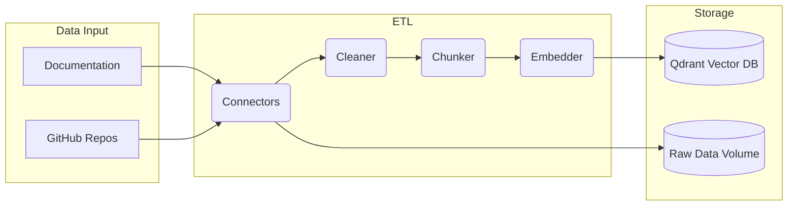
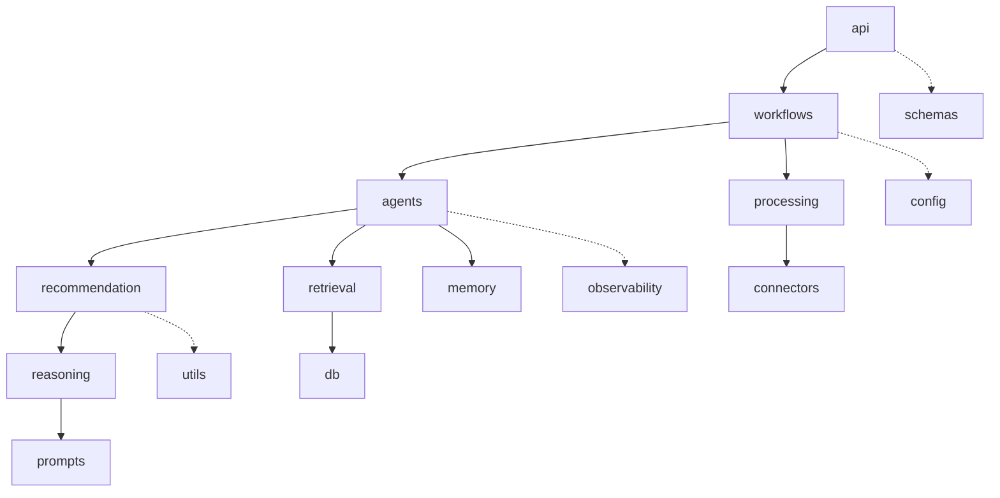
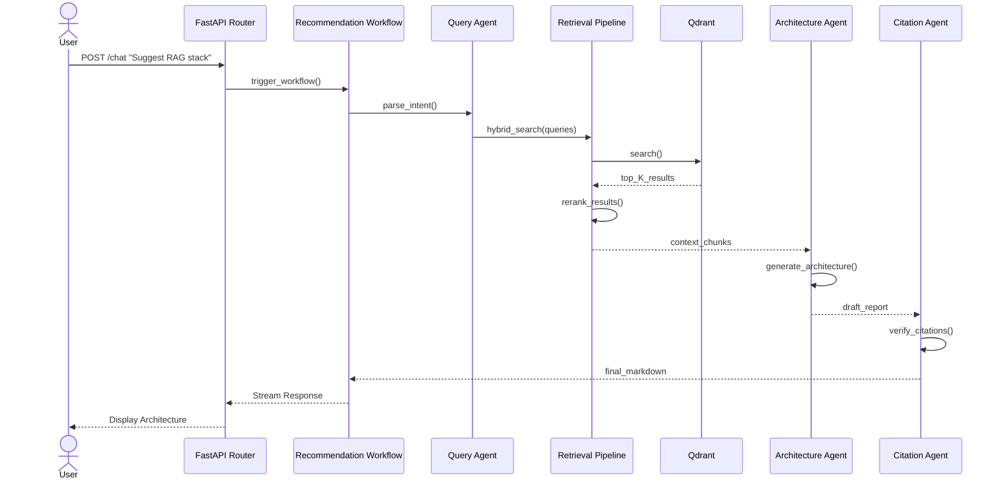
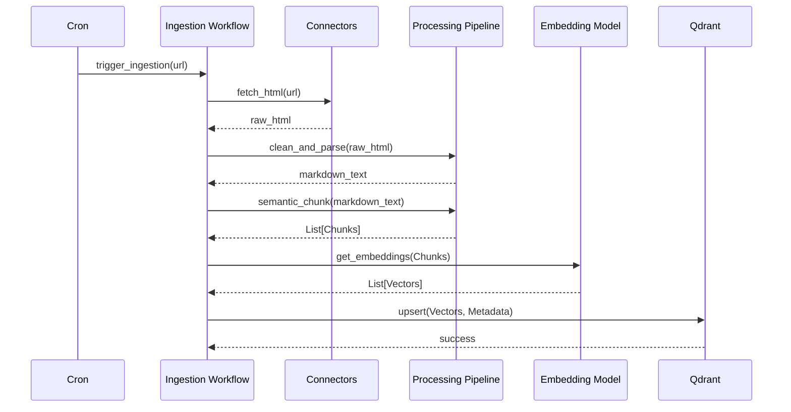
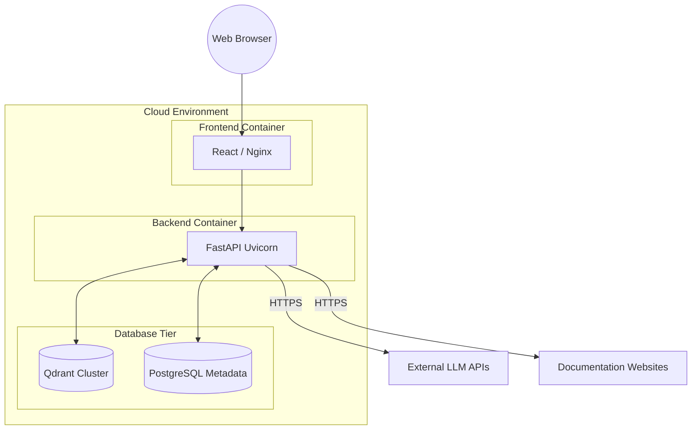

# Forge v2.0 Architecture Guide

Forge is a production-grade AI Engineering Research Assistant powered by Retrieval-Augmented Generation (RAG) and multi-agent LLM reasoning. It automatically ingests official AI documentation, builds a searchable vector knowledge base, and generates evidence-backed AI stack recommendations with citations.

---

## 1. High-Level System Architecture Diagram

```mermaid
graph TD
    User([User]) --> UI[React Frontend]
    UI -- REST API --> API[FastAPI Backend]
    
    subgraph Backend Orchestration
        API --> WF[Workflows]
        WF <--> AG[Agents]
    end
    
    subgraph Data Sources
        Web[Websites]
        GH[GitHub]
        Docs[PDFs/Markdown]
    end
    
    subgraph Ingestion Pipeline
        Data Sources --> CN[Connectors]
        CN --> PR[Processing ETL]
        PR --> Embed[Embedding Model]
        Embed --> DB[(Qdrant Vector DB)]
    end
    
    subgraph Inference Engine
        AG --> RET[Retrieval Pipeline]
        RET <--> DB
        RET --> REC[Recommendation Engine]
        REC --> RSN[Reasoning/LLM]
    end
```

---

## 2. Repository Overview

```text
Forge/
├── backend/                  # Python FastAPI Backend & RAG Engine
│   ├── app/
│   │   ├── api/              # FastAPI routers (REST endpoints)
│   │   ├── config/           # settings.py, constants.py
│   │   ├── observability/    # logging, tracing, metrics
│   │   ├── schemas/          # Pydantic models
│   │   ├── connectors/       # Source isolation (website, github, pdf, crawl4ai)
│   │   ├── processing/       # Document ETL (cleaner, parser, chunker, deduplicator)
│   │   ├── retrieval/        # dense, sparse, hybrid, reranker, qdrant, context_builder
│   │   ├── recommendation/   # The Heart of Forge: tradeoffs, tech selection, comparison
│   │   ├── reasoning/        # LLM interaction, output parsers, model routing
│   │   ├── prompts/          # system, templates, fewshot, guardrails
│   │   ├── memory/           # conversation.py, session_memory.py, user_context.py
│   │   ├── agents/           # Multi-agent system (Query, Retrieval, Evaluation, Citation)
│   │   ├── workflows/        # High-level orchestration (ingestion, retrieval, recommendation)
│   │   ├── db/               # PostgreSQL & VectorDB configuration
│   │   └── utils/            # hashing, validation, retry, text, time helpers
│   ├── tests/
│   ├── pyproject.toml
│   └── Dockerfile
├── frontend/                 # React UI
├── data/                     # Local Volume Storage
├── evaluation/               # CI/CD and Pipeline Evaluation
├── notebooks/                # Research and Experiments
├── docs/                     # Project Documentation
└── docker-compose.yml        # Orchestration
```

---

## 3. Folder Responsibilities

* **`backend/`**: Contains the complete FastAPI application, multi-agent orchestration, ingestion pipelines, and LLM reasoning engine.
* **`frontend/`**: The React-based user interface where AI engineers input project requirements and receive evidence-backed architectures.
* **`data/`**: Gitignored volume storage for raw scraped documents, cleaned markdown, JSON chunks, and extracted metadata generated during ingestion.
* **`evaluation/`**: Golden test datasets and evaluation scripts (e.g., Ragas/DeepEval) used to validate pipeline accuracy during CI/CD.
* **`notebooks/`**: Experimental scratchpad for data scientists to benchmark models, chunking strategies, and retrieval algorithms. No production code.
* **`docs/`**: Official architectural, API, and project documentation.

---

## 4. Module Responsibilities (`backend/app/`)

* **`api/`**: Exposes the REST interface to the frontend.
* **`config/`**: Manages environment variables and application-wide constants.
* **`observability/`**: Manages logging, OpenTelemetry tracing (e.g., Langfuse), and metrics gathering independently of business logic.
* **`schemas/`**: Pydantic models enforcing strict input/output structures for APIs and LLMs.
* **`connectors/`**: Handles fetching raw data from disparate sources (GitHub, Websites, PDFs, Crawl4AI).
* **`processing/`**: The ETL pipeline. Cleans HTML, extracts markdown, splits texts recursively/semantically, and deduplicates chunks.
* **`retrieval/`**: Manages Qdrant interactions, executing dense/sparse/hybrid searches, and reranking top-$K$ results.
* **`recommendation/`**: Analyzes technical trade-offs, evaluates technologies, and constructs final architectural recommendations.
* **`reasoning/`**: Wrappers for interacting with external LLMs, handling structured outputs and multi-model routing.
* **`prompts/`**: Static templates, few-shot examples, and guardrails decoupled from execution logic.
* **`memory/`**: Manages conversation history, active sessions, and user context.
* **`agents/`**: Autonomous reasoning loops handling distinct tasks (Query Understanding, Retrieval, Citation checking).
* **`workflows/`**: Connects agents, retrieval, and processing into explicit execution paths (e.g., `ingestion_workflow`, `recommendation_workflow`).
* **`db/`**: Connection managers for VectorDB and relational databases.
* **`utils/`**: Generic, stateless helpers (hashing, time formatting, regex).

---

## 5. Document Ingestion Flow
1. **Trigger**: Cron job or manual endpoint initiates `ingestion_workflow.py`.
2. **Extraction**: `connectors` pull raw HTML/Markdown from documentation sites or GitHub.
3. **Processing**: `processing/cleaner.py` strips boilerplate. `parser.py` maps headers. `chunker.py` executes semantic splitting to prevent context destruction.
4. **Embedding**: Chunks are sent to the embedding model (e.g., OpenAI `text-embedding-3-small`).
5. **Indexing**: Vectors and associated metadata are upserted into Qdrant via `db/`.

## 6. Retrieval Flow
1. **Query Intent**: The user query is rewritten by `agents/query_understanding_agent.py` to maximize retrieval effectiveness.
2. **Hybrid Search**: `retrieval/hybrid.py` queries Qdrant using both dense vectors and BM25 sparse matching.
3. **Reranking**: The top 50 chunks are sent to a Cross-Encoder (`retrieval/reranker.py`) which rescores them based on strict relevance to the query.
4. **Context Building**: The top 10 chunks are compiled into a unified context string by `retrieval/context_builder.py`.

## 7. Recommendation Flow
1. **Analysis**: The `recommendation/tradeoff_analyzer.py` compares the retrieved technology chunks against the user's constraints.
2. **Selection**: `technology_selector.py` logically pairs compatible frameworks, databases, and models.
3. **Synthesis**: The `architecture_generator.py` leverages the LLM via the `reasoning` module to draft the final proposal.
4. **Output**: The output is structurally validated and streamed back.

## 8. Multi-Agent Interaction Flow
* **Query Agent**: Breaks down complex user requests ("I need a RAG stack for a legal firm") into discrete search queries.
* **Retrieval Agent**: Iteratively fetches knowledge from Qdrant, expanding searches if initial results are insufficient.
* **Architecture Agent**: Takes the retrieved context and acts as the "Staff Engineer," weighing pros and cons.
* **Citation Agent**: Cross-references the generated architecture against the retrieved chunks to inject markdown citations and hallucination guardrails.

---

## 9. Backend Request Lifecycle
1. Request arrives at FastAPI (`api/chat.py`).
2. Payload is validated against Pydantic `schemas/`.
3. The `recommendation_workflow` is invoked.
4. `observability/` starts a parent trace.
5. `memory/` fetches the user's conversation history.
6. The Multi-Agent system executes Retrieval and Recommendation tasks.
7. The trace is finalized and flushed to Langfuse.
8. The final Markdown response is returned.

## 10. Frontend Request Lifecycle
1. User inputs constraints into the React UI.
2. React dispatches a POST request (handled by `services/api.ts`).
3. The UI enters a loading state.
4. As the backend streams chunks, the UI incrementally renders the Markdown.
5. Mermaid.js architecture diagrams and citation tooltips render dynamically upon completion.

---

## 11. Data Flow Diagram



## 12. Dependency Flow Diagram


*(Dashed lines denote cross-cutting concerns)*

---

## 13. Sequence Diagram for a User Query



## 14. Sequence Diagram for Document Ingestion



---

## 15. Technology Stack Justification

* **Frontend**: React + Vite + Tailwind CSS.
* **Backend**: Python 3.11 + FastAPI.
* **Vector DB**: Qdrant.
* **Embeddings**: OpenAI `text-embedding-3-small`.
* **Reranker**: Cohere Rerank.
* **LLM**: GPT-4o / Claude 3.5 Sonnet.
* **Orchestration**: Custom Agentic workflows (to avoid LangChain bloat).
* **Observability**: Langfuse / OpenTelemetry.

## 16. Why Each Technology was Selected

* **FastAPI**: Asynchronous, highly performant, natively supports Pydantic validation which perfectly mirrors the project's schema requirements.
* **Qdrant**: Natively supports Hybrid Search (BM25 + Dense Vectors) out of the box, which is critical for querying technical vocabulary like code snippets and API endpoints.
* **React/Vite**: Fast development loop; Tailwind + Shadcn ensures a highly professional, modern UI suitable for a premium engineering tool.
* **Cohere Rerank**: Drastically improves retrieval precision by cross-scoring semantic relevance, minimizing hallucination when generating complex architectures.
* **Custom Orchestration**: Heavy frameworks like LangChain obscure control flow. Custom `workflows/` and `agents/` ensure complete predictability and easier debugging.

---

## 17. Future Extensibility

* **Model Context Protocol (MCP)**: The `agents/` and `connectors/` modules cleanly expose interfaces that can be converted into standard MCP tools.
* **Tool Calling**: Native to the `reasoning` layer; agents can invoke tools in the `retrieval` or `processing` pipelines without affecting core application state.
* **Knowledge Graphs**: The `db/` module allows side-by-side integration of a Neo4j or Memgraph instance to query complex technological relationships (GraphRAG).
* **Multi-LLM Routing**: The `reasoning/` layer abstracts the LLM provider, allowing cheap models (Llama-3) to handle intent parsing and expensive models (GPT-4o) to handle architecture generation.
* **Continuous Ingestion**: The `workflows/ingestion_workflow` runs independently and can be bound to webhooks (e.g., GitHub releases) for real-time knowledge base updates.

---

## 18. Deployment Diagram



---

## 19. Security Considerations
* **API Key Management**: Stored securely in `.env` and injected strictly via `config/settings.py`. Never logged by the `observability` layer.
* **CORS Limits**: FastAPI configured to only accept requests from the deployed React frontend domain.
* **Prompt Injection**: Handled via the `prompts/guardrails/` module to prevent users from hijacking the Architecture Agent to write malicious code.
* **SSRF Prevention**: The `connectors/` crawler validates URLs against an allowed domains list to prevent scanning internal networks.

## 20. Scalability Considerations
* **Stateless Backend**: The FastAPI backend is entirely stateless (session data is passed via Redis or JWTs in `memory/`), allowing horizontal scaling of the API container.
* **Asynchronous I/O**: Web scraping and LLM API calls utilize Python `asyncio` to prevent thread blocking.
* **Vector DB Scaling**: Qdrant can be sharded and distributed as the knowledge base grows.
* **Batch Processing**: The `processing` and embedding pipelines process chunks in configurable batch sizes to respect third-party API rate limits.
